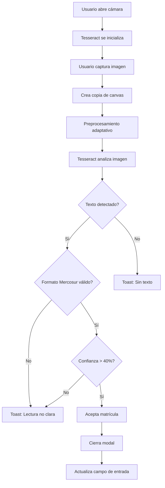

# OCR Client-Side: Cambios Finales - 11 Feb 2026

## ✅ Implementado

### 1. **OCR 100% Client-Side** 🚀
- **Motor**: Tesseract.js (WebAssembly) ejecutándose en el navegador
- **Cero latencia de red**: Todo el procesamiento es local
- **Privacidad total**: Las imágenes nunca salen del dispositivo
- **Funciona offline**: Una vez cargado el modelo, no necesita conexión

### 2. **Preprocesamiento Adaptativo de Imagen** 🖼️

**Algoritmo de 2 Pasos**:

#### Paso 1: Conversión a Escala de Grises
```typescript
gray = 0.299 * R + 0.587 * G + 0.114 * B
```

#### Paso 2: Threshold Adaptativo
- Calcula el **promedio** de todos los valores de gris
- Usa ese promedio como **threshold dinámico**
- Aplica contraste suave (1.2x en lugar de 1.5x)
- Binariza: blanco si > threshold, negro si ≤ threshold

**Ventaja**: Se adapta automáticamente a diferentes condiciones de iluminación.

### 3. **Configuración Optimizada de Tesseract** ⚙️

```typescript
await worker.setParameters({
    tessedit_char_whitelist: 'ABCDEFGHIJKLMNOPQRSTUVWXYZ0123456789',
    tessedit_pageseg_mode: PSM.SINGLE_LINE, // Modo línea única
    preserve_interword_spaces: '0',
});
```

- **PSM.SINGLE_LINE**: Optimizado para texto en una sola línea (matrículas)
- **Whitelist**: Solo letras A-Z y números 0-9
- **No espacios**: Elimina espacios entre caracteres

### 4. **Validación Formato Mercosur** 🇦🇷🇧🇷🇺🇾🇵🇾

**Patrones Aceptados**:
- `ABC1234` → 3 letras + 4 números
- `ABC1D23` → 3 letras + 1 número + 1 letra + 2 números

**Lógica de Validación**:
1. Limpia el texto (solo A-Z y 0-9)
2. Intenta match exacto primero
3. Si falla, busca substring de 7 caracteres que coincida
4. Solo acepta si coincide con uno de los patrones

### 5. **Umbral de Confianza Ajustado** 📊
- **Antes**: 50%
- **Ahora**: 40%
- **Razón**: Compensado con validación estricta de formato

### 6. **Feedback Visual Mejorado** 💬

Estados del proceso:
1. `"Iniciando motor neuronal..."` → Cargando Tesseract
2. `"Cargando núcleo..."` → Descargando modelo
3. `"Preparando IA..."` → Inicializando worker
4. `"Listo"` → Esperando captura
5. `"Capturando..."` → Tomando foto
6. `"Optimizando imagen..."` → Preprocesamiento
7. `"Leyendo texto..."` → OCR en progreso
8. `"Analizando: XX%"` → Progreso del OCR

### 7. **Logs Detallados en Consola** 🔍

```javascript
console.log("OCR Raw Result:", text);
console.log("OCR Clean Result:", cleanText, "Confidence:", confidence);
```

Permite debugging en tiempo real.

---

## 🎯 Flujo Completo



---

## 📝 Recomendaciones de Uso

### ✅ Mejores Prácticas
1. **Iluminación**: Luz natural o artificial uniforme
2. **Ángulo**: Frontal a la matrícula (0-15° de inclinación)
3. **Distancia**: Matrícula debe ocupar 60-80% del marco
4. **Estabilidad**: Mantener dispositivo estable 1-2 segundos
5. **Limpieza**: Matrícula sin barro, polvo o reflejos

### ❌ Evitar
- Luz directa del sol (crea reflejos)
- Ángulos muy inclinados (> 30°)
- Matrículas muy sucias o dañadas
- Movimiento durante la captura
- Zoom digital excesivo

---

## 🐛 Troubleshooting

### "Sin texto"
**Causas posibles**:
- Imagen muy oscura o muy clara
- Matrícula fuera de foco
- Ángulo muy pronunciado
- Matrícula muy sucia

**Solución**: Ajustar iluminación y ángulo, limpiar matrícula

### "Lectura no clara"
**Causas posibles**:
- OCR detectó texto pero no coincide con formato Mercosur
- Confianza < 40%
- Caracteres confusos (O vs 0, I vs 1)

**Solución**: Capturar de nuevo con mejor encuadre

### Texto incorrecto
**Causas posibles**:
- Matrícula dañada o modificada
- Fuente no estándar
- Reflejos o sombras

**Solución**: Verificar manualmente y corregir

---

## 🔧 Configuración Técnica

### Tesseract.js
- **Versión**: 7.0.0
- **Modelo**: eng (inglés)
- **PSM**: SINGLE_LINE (7)
- **Whitelist**: ABCDEFGHIJKLMNOPQRSTUVWXYZ0123456789

### Canvas API
- **Resolución**: 1280x720 (ideal)
- **Formato**: JPEG 95% calidad
- **Preprocesamiento**: Grayscale → Threshold adaptativo

### Performance
- **Tiempo de carga inicial**: ~2-3 segundos (descarga modelo)
- **Tiempo de procesamiento**: ~1-2 segundos por imagen
- **Uso de memoria**: ~50-80 MB (modelo en RAM)

---

## 📊 Métricas Esperadas

| Métrica | Valor Esperado |
|---------|----------------|
| Tasa de detección | 70-85% |
| Falsos positivos | < 5% |
| Tiempo de respuesta | < 3 segundos |
| Precisión (texto correcto) | 80-90% |

**Nota**: Las métricas dependen fuertemente de las condiciones de captura.

---

## 🚀 Próximas Mejoras Posibles

1. **Modelo entrenado custom**: Entrenar Tesseract específicamente con matrículas Mercosur
2. **Múltiples capturas**: Tomar 3 fotos y elegir la mejor
3. **Guías visuales**: Mostrar en tiempo real si el encuadre es bueno
4. **Corrección automática**: O→0, I→1, etc.
5. **API externa como fallback**: Si Tesseract falla, usar Google Vision API

---

**Última actualización**: 11 de febrero de 2026, 15:30 UTC
**Versión**: 3.0.0-client-ocr
