# Qué hace OmniAccess LPR

OmniAccess LPR controla los accesos vehiculares de un predio cerrado: lee la matrícula de cada
vehículo que llega, decide si está autorizado y deja registro fotográfico y en video de todo lo
que pasa. Funciona sin intervención humana; el operador interviene solo cuando el sistema levanta
la mano.

Este capítulo es el inventario completo de lo que el sistema puede hacer. El resto del manual
explica cómo configurar cada cosa.

## Lectura de matrículas y control de acceso

| Función | Qué hace exactamente |
|---|---|
| **Lectura ANPR** | Cada cámara lee la matrícula del vehículo que cruza su línea de detección, con la confianza de lectura (habitualmente 95–99 %) |
| **Decisión de acceso** | Contrasta contra la base de vehículos autorizados y su horario permitido: Autorizado, Denegado o Lista negra |
| **Clasificación del vehículo** | La cámara reporta marca, color y tipo (auto, camioneta, pickup, van, camión, ómnibus, buggy, moto) sin configuración adicional |
| **Entrada / salida** | Al salir, calcula cuánto tiempo estuvo adentro: el sistema sabe quién está adentro en cada momento |
| **Merodeo** | Detecta un vehículo que pasa repetidas veces por el mismo acceso sin ingresar |
| **Lista de vigilancia** | Matrículas marcadas (buscada, prohibida, VIP) que disparan alerta sonora y visual al aparecer |
| **Registro fotográfico** | Foto completa de la escena y recorte de la patente, guardados por cada evento |
| **Grabación asociada** | Un toque abre el video del grabador en el segundo exacto del acceso |

## Gestión

| Función | Qué hace exactamente |
|---|---|
| **Padrón de residentes** | Personas, unidades, vehículos y credenciales, con el vínculo entre ellos |
| **Grupos y horarios** | Reglas de quién puede entrar y cuándo, con calendario de excepciones y feriados |
| **Alta rápida** | Registrar un vehículo desde el propio evento, con la matrícula ya cargada |
| **Vigencias** | Autorizaciones con fecha de inicio y fin, para proveedores y visitas temporales |
| **Tags RFID** | Credenciales físicas como alternativa o complemento de la matrícula |
| **Auditoría** | Quién cambió qué y cuándo, sobre toda la configuración |

## Investigación y reportes

| Función | Qué hace exactamente |
|---|---|
| **Búsqueda en lenguaje natural** | *"camioneta blanca ayer a la tarde"*, sobre los accesos propios del predio |
| **Búsqueda por imagen** | Recortar un vehículo o una persona en una captura y buscar dónde más apareció |
| **Ficha de la matrícula** | Frecuencia de paso por día, cámaras habituales, horarios típicos de entrada y salida |
| **Exportación de evidencia** | ZIP con foto, recorte de patente, datos del evento y video de 30 segundos |
| **Reportes** | Informes en PDF con portada de marca propia, gráficas y totales |

## Operación y avisos

| Función | Qué hace exactamente |
|---|---|
| **Notificaciones** | Reglas que disparan avisos por Telegram, WhatsApp o correo según lo que pase |
| **Cola de despachos** | Todo aviso enviado queda registrado, con su resultado y su reintento |
| **Salud de equipos** | Sondeo activo de cada cámara y del grabador: estado, latencia, hora, disco |
| **Alertas de sistema** | Aviso cuando una cámara deja de reportar, se desincroniza la hora o se llena el disco |
| **Módulo de guardias** | Bitácora, consola de puesto, tablets, rondas y botón de pánico |
| **Plazas y mapa** | Ocupación del estacionamiento y plano del predio con cámaras y personal |

## En qué nos diferenciamos

| | OmniAccess | Lo habitual en el mercado |
|---|---|---|
| **Instalación** | Servidor propio en el predio; funciona sin internet | Nube obligatoria: sin internet no hay control de acceso |
| **Marcas de cámara** | Hikvision, Bosch, Akuvox y ONVIF en el mismo sistema | Atado a una marca |
| **Evidencia** | Foto, recorte y video en un ZIP, en dos clics | Video en un sistema aparte, que hay que buscar a mano |
| **Búsqueda** | En lenguaje natural sobre los accesos propios | Filtros por fecha y matrícula exacta |
| **Diagnóstico** | El sistema avisa que una cámara se cayó antes de que lo note el cliente | El cliente se entera cuando falta un registro |
| **Guardias** | Tablets, rondas, pánico y bitácora integrados al mismo sistema | Producto separado, de otro proveedor |
| **Reportes** | Con la marca del cliente, configurable desde el panel | Planilla exportada |
| **Costo** | Licencia por instalación, sin cargo por evento ni por cámara en la nube | Abono mensual por cámara |

> Este manual documenta el **modo LPR**. Los modos *Filas* y *Face* tienen sus propios manuales:
> el sistema es el mismo, cambian las funciones habilitadas.

# Qué administra este manual

El administrador es quien decide **quién entra, cuándo, y qué pasa cuando algo se sale de lo
normal**. No opera el portón: configura las reglas con las que el sistema opera solo.

Este manual cubre el panel completo. Para el uso diario del monitor está el *Manual del Operador*;
para la instalación y las cámaras, el *Manual del Instalador*.

## El modelo de datos, en una página

Antes de tocar nada conviene entender cómo se relacionan las cosas. Todo el sistema se apoya en
esta cadena:

```
Unidad (lote / casa / oficina)
  └── Usuario (residente, empleado, visitante)
        └── Credencial (matrícula, tarjeta RFID, rostro)
              └── Grupo de acceso (qué puertas, en qué horario)
```

- Una **unidad** agrupa personas: la casa 42, la oficina 3B.
- Un **usuario** pertenece a una unidad y tiene un rol.
- Una **credencial** identifica al usuario ante el sistema. Un usuario puede tener varias (dos
  autos y una tarjeta).
- Un **grupo de acceso** define por dónde y cuándo puede pasar.

> El error más común al empezar es cargar matrículas sueltas sin usuario ni unidad. Funciona, pero
> el día que hay que buscar "todos los vehículos de la casa 42" no hay forma. Cargá siempre la
> cadena completa.

## Los roles

| Rol | Puede |
|---|---|
| **Superadministrador** | Todo, incluida la configuración del sistema y otros administradores |
| **Administrador** | Usuarios, vehículos, reglas, reportes. No cambia el modo ni la configuración crítica |
| **Operador** | Ver el monitor, el historial y registrar. No modifica configuración |
| **Guardia** | La consola del guardia y la tablet |

---

# El panel principal

» Menú lateral → Monitor en Vivo (o el panel, según la instalación)

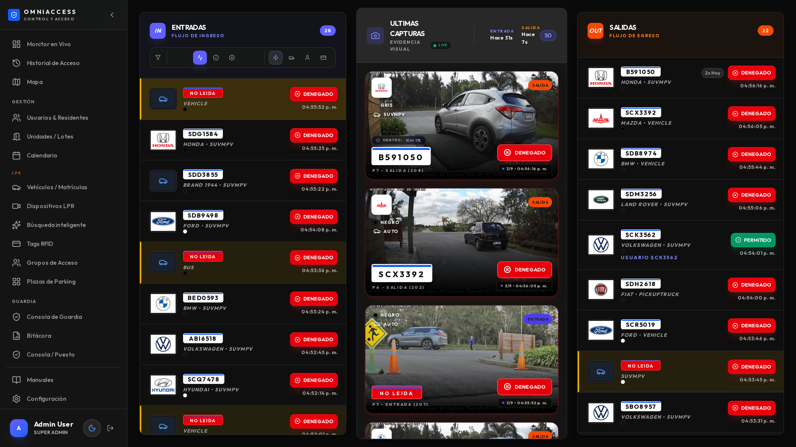

Muestra el estado del sistema de un vistazo: accesos del día, vehículos adentro, dispositivos en
línea y las alertas activas.

> ⏱ Los números se actualizan **en vivo** por websocket. Si dejan de moverse durante varios
> minutos con tráfico en los portones, revisá el estado de los dispositivos.

---

# Usuarios y residentes

» Menú lateral → Usuarios & Residentes

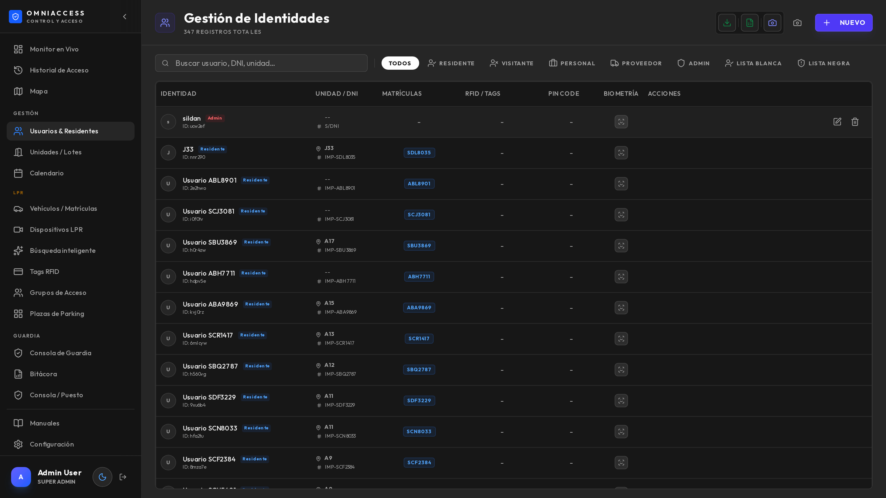

Es el registro de todas las personas del predio: residentes, empleados, proveedores frecuentes.

## Dar de alta un usuario

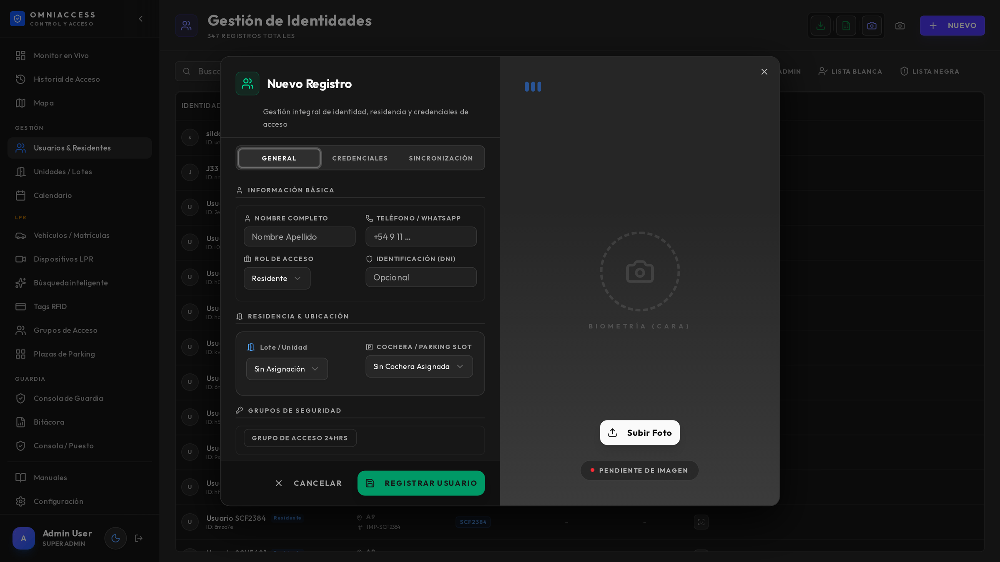

1. **Nuevo usuario**.
2. Nombre y apellido.
3. **Unidad**: a qué lote o casa pertenece.
4. **Rol**: define qué puede hacer en el sistema (la mayoría son residentes, sin acceso al panel).
5. **Credenciales**: matrícula(s), tarjeta RFID, rostro.
6. **Grupo de acceso**: por dónde y cuándo puede pasar.
7. Guardar.

> ⏱ El alta tiene efecto **inmediato**: el vehículo que se acaba de cargar ya entra en la próxima
> lectura, sin reiniciar nada.

## Alta rápida desde un evento

La forma más práctica de cargar un vehículo nuevo es desde donde apareció: en el monitor o en la
ficha del evento, el botón **Registrar** abre el alta con la matrícula ya escrita. Evita errores de
tipeo, que son la causa número uno de "no me abre".

## Estados de un usuario

| Estado | Efecto |
|---|---|
| **Activo** | Sus credenciales funcionan |
| **Suspendido** | Sus credenciales son rechazadas, pero el registro se conserva |
| **Eliminado** | Se borra; los eventos históricos quedan (con la matrícula, sin el nombre) |

> Para una baja temporal (un residente que se muda por unos meses) usá **suspendido**, no
> eliminado: conserva el historial y la relación con la unidad.

---

# Unidades y lotes

» Menú lateral → Unidades / Lotes

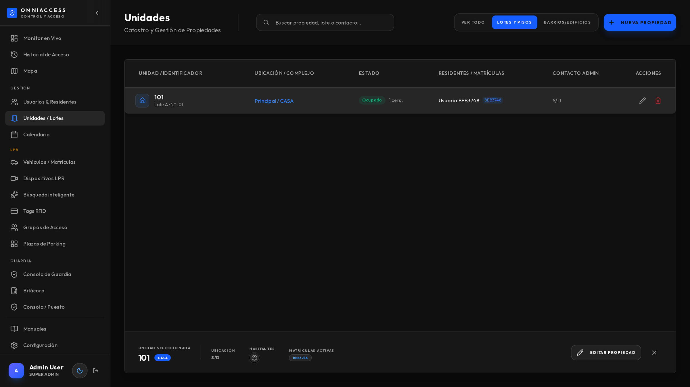

Las unidades son la estructura del predio: lotes, casas, oficinas, apartamentos. Cada usuario
pertenece a una.

Sirven para tres cosas concretas:

1. **Buscar por unidad**: todos los vehículos de la casa 42.
2. **Reportes por unidad**: cuántos accesos tuvo cada lote.
3. **Plazas de parking**: qué plaza le corresponde a cada unidad.

Se pueden importar en lote desde una planilla al iniciar el sistema.

---

# Vehículos y matrículas

» Menú lateral → Vehículos / Matrículas

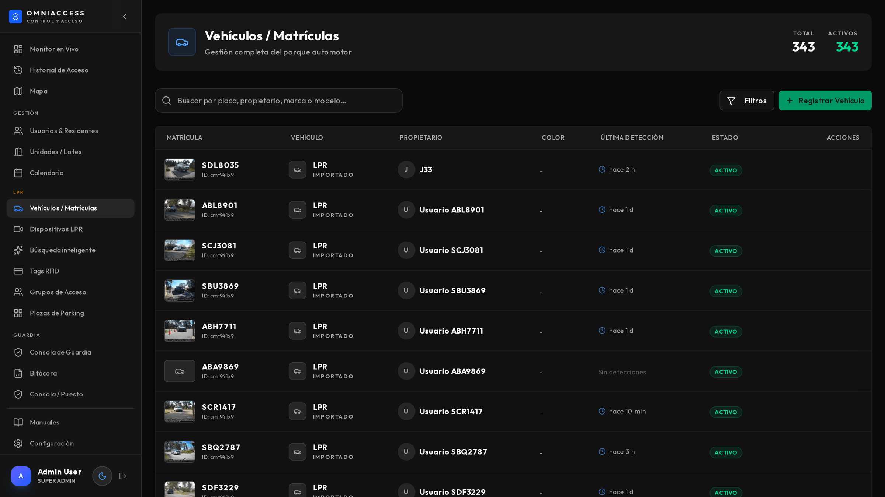

Es la vista centrada en el vehículo, no en la persona. Cada fila muestra la matrícula, el
propietario, la unidad, y **la última vez que fue detectado** con su foto.

## Para qué se usa

- Verificar si una matrícula está cargada y a nombre de quién.
- Ver la última foto de un vehículo (útil cuando alguien reporta un auto sospechoso).
- Corregir una matrícula mal cargada.
- Dar de baja un vehículo que se vendió.

## La ficha del vehículo

Al abrir una fila se ve el historial completo de ese vehículo, con sus fotos y accesos.

> Si una matrícula aparece dos veces con distinto propietario, el sistema usa la más reciente.
> Revisá los duplicados: casi siempre son un auto que cambió de dueño dentro del predio y quedó
> cargado dos veces.

---

# Grupos de acceso y horarios

» Menú lateral → Grupos de Acceso

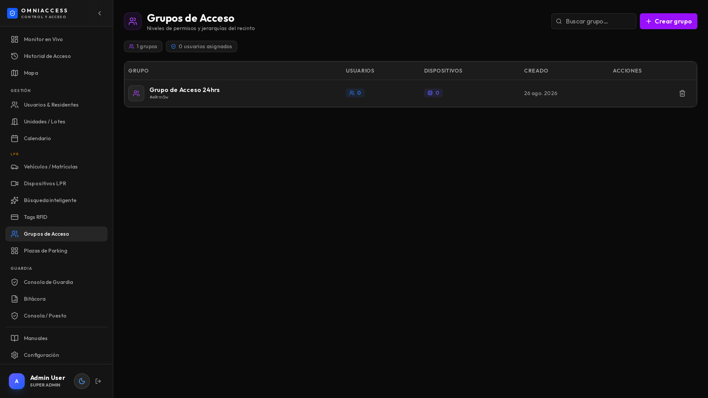

Un grupo de acceso responde a dos preguntas: **por dónde** puede pasar y **cuándo**.

## Cómo se arma

1. Nombre del grupo (por ejemplo *Residentes*, *Personal de servicio*, *Proveedores*).
2. **Dispositivos**: qué accesos habilita.
3. **Horario**: qué franjas y qué días.
4. Asignar el grupo a los usuarios.

## Ejemplos que se usan siempre

| Grupo | Dispositivos | Horario |
|---|---|---|
| Residentes | Todos | 24/7 |
| Personal de servicio | Portón principal | Lunes a viernes, 7 a 19 |
| Proveedores | Portón de servicio | Lunes a sábado, 8 a 18 |
| Obra | Portón de servicio | Lunes a viernes, 7 a 17, con fecha de vencimiento |

» Menú lateral → Calendario

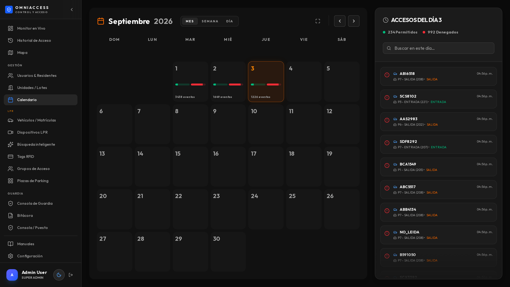

El calendario define **feriados y excepciones**: días en los que los horarios normales no aplican.
Es lo que evita tener que reconfigurar los grupos cada fin de semana largo.

> ⏱ Un cambio de horario tiene efecto **en la siguiente lectura**. No hace falta reiniciar ni
> esperar: probalo con un vehículo del grupo modificado.

---

# Lista de vigilancia

Sirve para marcar matrículas que requieren atención: vehículos buscados, prohibidos o VIP.

Se accede desde el monitor (icono de vigilancia) o desde la ficha de cualquier evento con el botón
**Lista negra**.

| Categoría | Efecto al detectarse |
|---|---|
| **Lista negra** | Alerta sonora, tarjeta resaltada en rojo, notificación al supervisor |
| **Lista blanca** | Se marca como autorizado aunque no tenga usuario asociado |
| **Búsqueda** | Avisa cuando aparece, sin bloquear |

> La lista se sincroniza con los **roles de usuario**: si un usuario tiene rol de bloqueado, sus
> matrículas figuran automáticamente en la lista negra sin cargarlas dos veces.

---

# Dispositivos

» Menú lateral → Dispositivos LPR

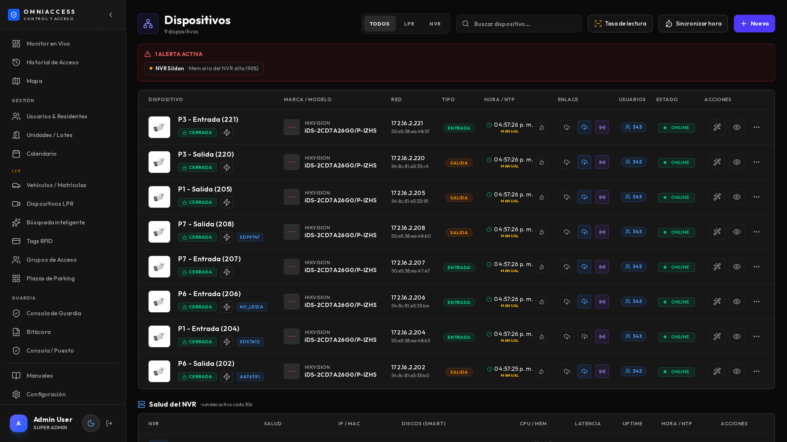

Es el inventario de cámaras y grabadores, con su estado real.

## Qué muestra cada fila

| Columna | Qué significa |
|---|---|
| **Estado** | Verde: responde. Rojo: sin respuesta (dos sondeos seguidos) |
| **Latencia** | Cuánto tarda en contestar. Más de 500 ms sostenidos indica problema de red |
| **Hora / NTP** | Desfase del reloj de la cámara contra el servidor |
| **Dirección** | Si es de entrada o de salida |
| **Canal NVR** | A qué canal del grabador corresponde (para la grabación) |

> ⚠ El **desfase de reloj** es el problema silencioso más frecuente. Una cámara con la hora corrida
> genera eventos con hora incorrecta y la grabación no coincide. El botón de **sincronizar hora**
> lo resuelve en un clic.

## Alta de una cámara

Al agregar un dispositivo Hikvision, el sistema consulta la cámara y completa modelo, MAC y
firmware solo. Solo hay que indicar nombre, IP, credenciales y dirección (entrada o salida).

Para el detalle de calibración ANPR y mapeo de canales, ver el *Manual del Instalador*.

---

# Notificaciones y despachos

» Menú lateral → Notificaciones

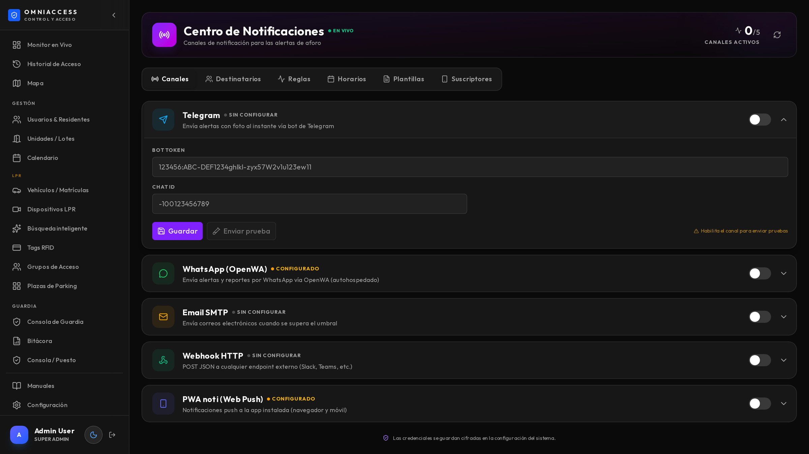

Define **qué avisa, a quién y por dónde**.

## Armar una regla

1. **Evento disparador**: acceso denegado, lista negra, merodeo, cámara caída, punto de ronda
   vencido, pánico.
2. **Condiciones**: en qué cámaras, en qué horario.
3. **Destinatarios**: personas o grupos.
4. **Canal**: Telegram, WhatsApp, correo o notificación push.
5. **Contenido**: con foto, con clip de video, o solo texto.

## Los canales

| Canal | Requiere | Entrega |
|---|---|---|
| **Telegram** | Bot configurado | Inmediata, con foto o video |
| **WhatsApp** | Pasarela OpenWA en la red | Inmediata, con imagen o video |
| **Correo** | Servidor SMTP | Según el servidor, típicamente segundos |
| **Push** | Que el destinatario haya instalado la PWA | Inmediata |

» Menú lateral → Despachos

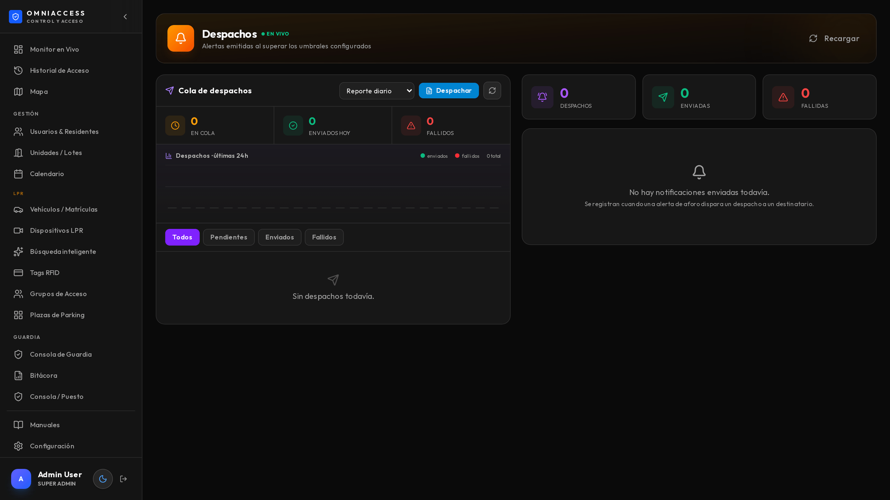

Muestra la cola de envíos pendientes (izquierda) y lo efectivamente enviado (derecha), con
destinatario, canal y contenido. Es donde se verifica que un aviso salió.

> ⏱ Un aviso con foto sale en **2 a 5 segundos**. Con clip de video, entre **10 y 20 segundos**
> (hay que generar el clip). Si la cola crece y no baja, revisá que el servicio de despacho esté
> corriendo.

---

# Búsqueda inteligente

» Menú lateral → Búsqueda inteligente

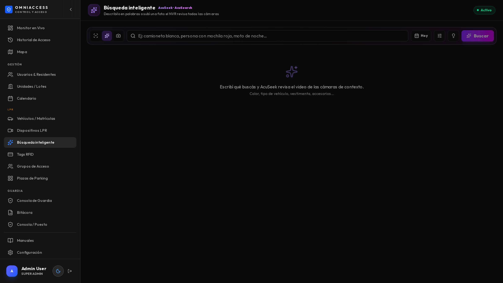

Tiene tres modos. El detalle de uso está en el *Manual del Operador*; lo que el administrador
necesita saber es **qué cubre cada uno**:

| Modo | Fuente | Cobertura |
|---|---|---|
| **Accesos** | Base de datos propia | Todas las cámaras de matrículas |
| **Por texto** | Índice del grabador | Solo cámaras de contexto |
| **Por imagen** | Índice del grabador | Solo cámaras de contexto |

> ⚠ Las cámaras que leen matrículas **no** alimentan la búsqueda del grabador: en esos equipos el
> motor de matrículas y el de análisis de video son excluyentes. Por eso existe el modo Accesos,
> que cubre los portones con la base propia. Si se necesita búsqueda visual en un acceso, hay que
> instalar una segunda cámara de contexto.

---

# Reportes

» Menú lateral → Reportes

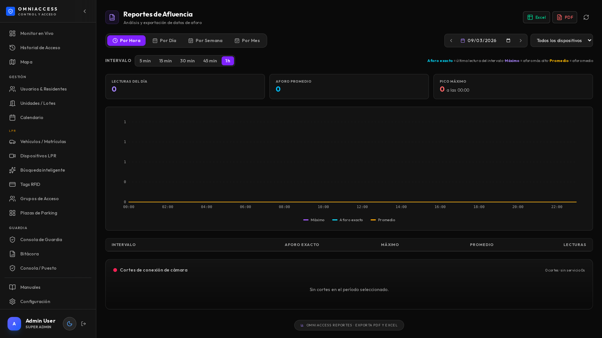

Genera Excel y PDF con la marca del cliente. Los reportes habituales:

- Accesos por período, con filtros.
- Accesos por unidad.
- Vehículos no registrados que ingresaron.
- Actividad por cámara.
- Disponibilidad de dispositivos.

El diseño de la portada (logo, colores, firmas) se configura en *Configuración → Branding →
Reportes*.

---

# Configuración

» Menú lateral → Configuración

La configuración está agrupada en cuatro secciones.

## Sistema

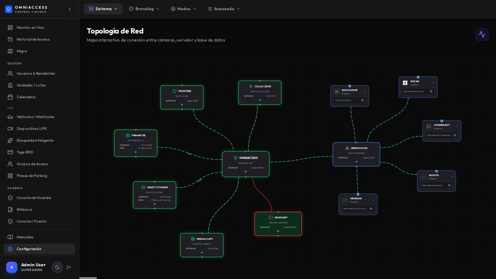

- **Modo del sistema**: LPR, Control de Filas o Face. Es exclusivo: define qué módulos se ven.
- **Datos de la instalación**: nombre, zona horaria, idioma.
- **Administradores**: quién accede al panel y con qué rol.

> ⚠ Cambiar el modo del sistema reconfigura el menú completo y oculta módulos. No se pierden datos,
> pero conviene hacerlo fuera de horario.

## Branding

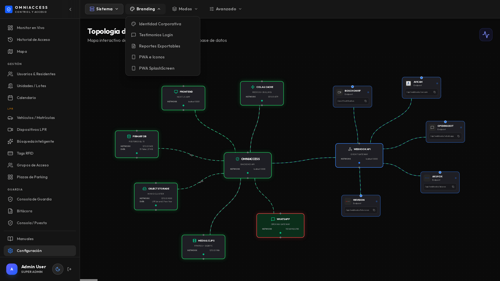

- Logo y colores del login.
- Marca de los reportes: portada, logo, firmas de "realizado por" y "autorizado por".
- Imagen de fondo del acceso.

## Almacenamiento

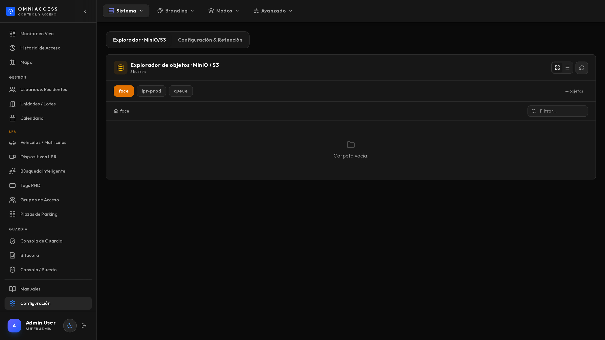

Define cuánto tiempo se guardan las fotos y con qué política se borran.

| Parámetro | Qué controla | Valor típico |
|---|---|---|
| **Retención de fotos** | Días que se conservan las capturas | 30 días |
| **Retención de clips** | Días de los videos generados | 7 días |
| **Bucket** | Dónde se guardan | Según instalación |

> ⚠ Este es el ajuste que decide si el disco se llena. Con 8 cámaras y tráfico normal se generan
> **3 a 4 GB por día**. Con 30 días de retención hacen falta unos 120 GB solo de fotos.

## Avanzado

- Integración con Telegram y WhatsApp.
- Parámetros de los drivers de cámara.
- Monitor de webhooks (diagnóstico).
- Respaldo y restauración de la base.

---

# Tags RFID

» Menú lateral → Tags RFID

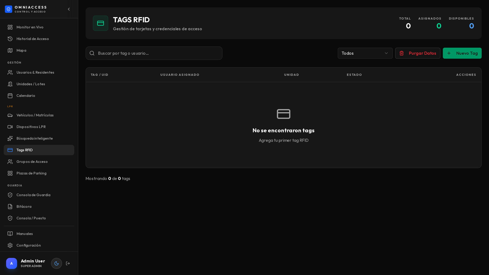

Para instalaciones con lectores de proximidad. Cada tag se asocia a un usuario igual que una
matrícula, y se le aplican los mismos grupos de acceso.

---

# Auditoría

» Menú lateral → Consola de Guardia → Auditoría (o Configuración → Auditoría)

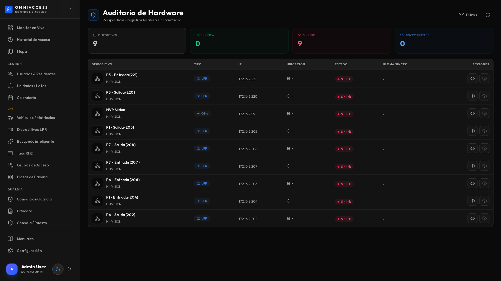

Registra **quién hizo qué** en el panel: altas, bajas, cambios de configuración, apertura manual de
portones. Cada entrada tiene usuario, fecha, acción y detalle.

> Es lo que se revisa cuando hay que responder "¿quién autorizó este vehículo?" o "¿quién cambió
> este horario?". No se puede borrar desde el panel.

---

# Pantallas de kiosko

» Menú lateral → Kiosko

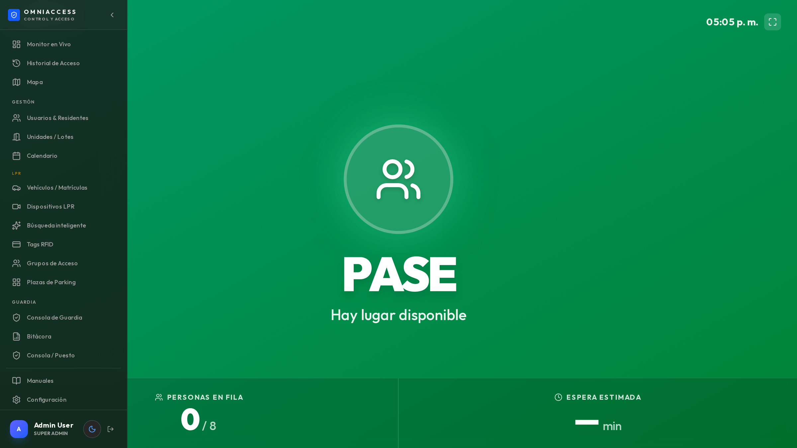

Permite armar vistas para televisores del predio: la última matrícula leída, el estado de las
plazas, o un tablero de estadísticas. Se configuran acá y se abren en el navegador del TV.

---

# Tareas frecuentes

## Alta de un residente nuevo con dos vehículos

1. *Usuarios → Nuevo usuario*.
2. Nombre, unidad, rol Residente.
3. Agregar las dos matrículas como credenciales.
4. Grupo de acceso: Residentes.
5. Guardar. Efecto inmediato.

## Habilitar a un proveedor por tiempo limitado

1. Crear el usuario con rol Proveedor.
2. Asignarle un grupo con horario restringido.
3. En el usuario, poner **fecha de vencimiento**.
4. Al vencer, sus credenciales dejan de funcionar solas.

## Investigar un incidente de anoche

1. *Búsqueda inteligente → Accesos*: `entradas denegadas anoche`.
2. Abrir los eventos sospechosos.
3. En cada uno, **Grabación** para ver el video y **Exportar** para llevarse la evidencia.
4. Si hay un vehículo a seguir, **Encuadrar → Buscar similares** para ver por dónde más pasó.

## Responder un reclamo de "no me abrió"

1. Buscar la matrícula en *Búsqueda inteligente*.
2. Si el evento existe y dice Denegado: revisar el grupo de acceso y el horario del usuario.
3. Si el evento no existe: la cámara no lo leyó. Mirar la grabación y revisar el estado de esa
   cámara en *Dispositivos*.
4. Exportar el ZIP como respaldo de la respuesta.

## Preparar el cierre de mes

1. *Reportes*: accesos del mes, por unidad.
2. Revisar los vehículos no identificados recurrentes y darlos de alta o marcarlos.
3. Revisar las alertas de dispositivos del período.
4. Verificar el espacio en disco contra la retención configurada.
