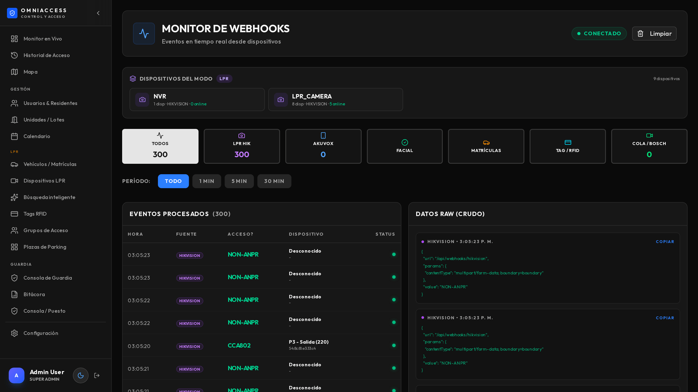
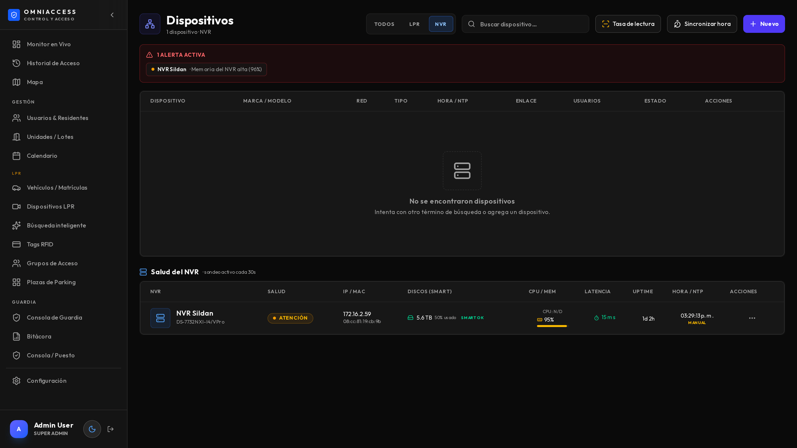
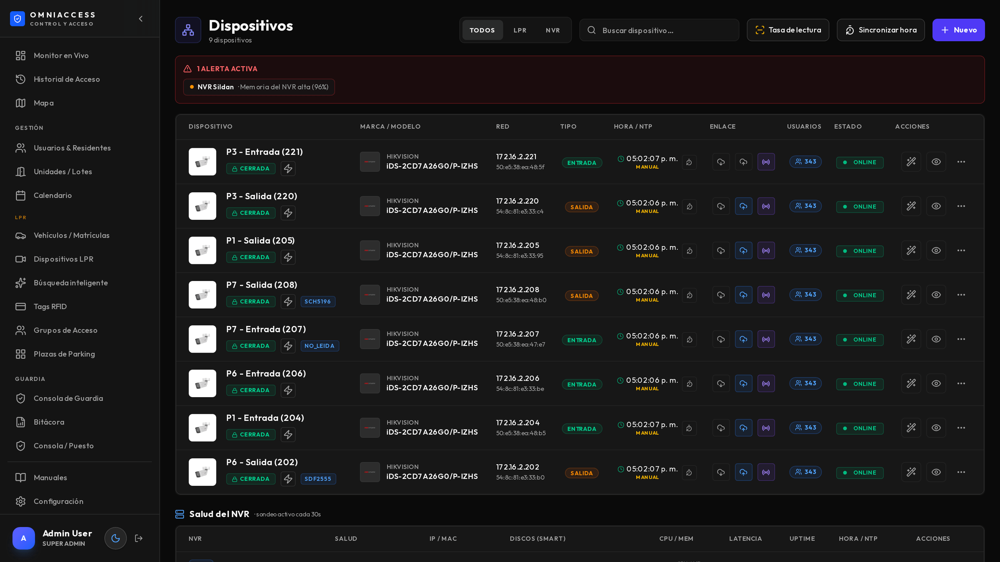

# Antes de ir a la obra

Este manual es para el técnico que instala y mantiene. Asume que sabés de redes y de cámaras IP;
no explica qué es una IP ni cómo se poncha un cable.

## Lo que define si la instalación sale bien

En orden de importancia, y por experiencia:

1. **La posición de la cámara.** Una cámara mal colocada no se arregla con software. Ver el
   capítulo de emplazamiento.
2. **La iluminación nocturna.** El 80 % de las lecturas fallidas ocurren de noche.
3. **El reloj.** Cámaras, grabador y servidor con la misma hora. Si no, la grabación no coincide
   con el evento.
4. **La red.** Cada cámara necesita llegar al servidor; el servidor, a las cámaras y al grabador.

## Arquitectura mínima

```
        Cámaras LPR (una por acceso, entrada y salida)
                    │ ISAPI / HTTP
                    ▼
        ┌───────────────────────┐        ┌──────────────┐
        │      Servidor         │◄──────►│  NVR / DVR   │
        │  OmniAccess           │  RTSP  │  (grabación) │
        │  - app web            │        └──────────────┘
        │  - webhooks           │
        │  - base de datos      │        ┌──────────────┐
        │  - almacenamiento     │◄──────►│  Tablets     │
        └───────────────────────┘  WiFi  │  de guardia  │
                    │                    └──────────────┘
                    ▼
            Puesto de monitoreo
```

## Requisitos del servidor

| | Hasta 4 cámaras | 8 a 16 cámaras |
|---|---|---|
| CPU | 4 núcleos | 8 núcleos |
| Memoria | 8 GB | 16 GB |
| Disco | 250 GB SSD | 500 GB SSD |
| Red | 1 Gb | 1 Gb |
| Sistema | Debian 12/13 o Ubuntu LTS | Igual |

> El disco es la variable que más se subestima. Con 8 cámaras y tráfico normal se generan **3 a
> 4 GB por día** de fotos. Calculá el disco contra la retención que va a pedir el cliente.

---

# Emplazamiento de las cámaras

Es la parte que decide la tasa de lectura. Vale la pena discutirla con el cliente antes de tirar
un solo cable.

## Las cuatro reglas

**1. Ángulo.** La cámara debe mirar la patente lo más de frente posible. Hasta 30° horizontales y
30° verticales la lectura es buena; más allá cae rápido.

**2. Distancia.** La patente tiene que ocupar entre 100 y 300 píxeles de ancho en la imagen. En la
práctica: entre 4 y 8 metros del punto donde el vehículo se detiene o pasa lento.

**3. Un carril por cámara.** Una cámara que cubre entrada y salida a la vez lee mal las dos. Si el
acceso tiene dos carriles, van dos cámaras.

**4. Punto de detención.** Lo ideal es leer donde el vehículo va lento o frena: antes de la barrera,
no después.

## Iluminación

| Situación | Qué hacer |
|---|---|
| Acceso con luz artificial | Verificar que ilumine la patente, no el parabrisas |
| Sin iluminación | Cámara con IR propio, apuntado a la zona de la patente |
| Contraluz (sol de frente) | Reubicar o agregar visera. El WDR ayuda pero no hace milagros |
| Reflejo en patentes nuevas | Bajar la potencia del IR: el exceso satura y "quema" la patente |

> ⚠ Probá **de noche** antes de dar por terminada la instalación. Una cámara que lee perfecto a las
> 15 h puede tener 40 % de aciertos a las 3 de la mañana, y es cuando más importa.

---

# Puesta en marcha del servidor

El detalle completo está en `docs/INSTALL.md` del repositorio. Acá va el resumen operativo.

## Servicios que deben quedar arriba

| Servicio | Rol | Verificación |
|---|---|---|
| **Aplicación web** | Panel y API | Abre la página de ingreso |
| **Webhooks** | Recibe los eventos de las cámaras | Log con eventos entrando |
| **Base de datos** | Todo el registro | El panel muestra datos |
| **Almacenamiento** | Fotos y clips | Las capturas se ven |
| **Servidor de video** | Video en vivo | El monitor muestra imagen |
| **Cola de despacho** | Notificaciones | Los avisos salen |

Todos arrancan solos al encender el servidor. Verificá eso **reiniciando el servidor una vez**
antes de entregar: es la prueba que más problemas evita después.

## Instalación sin internet

El sistema funciona completo sin salida a internet. Lo único que requiere conexión:

- Los avisos por Telegram y WhatsApp.
- Los logos de marcas de vehículos en el panel (se degradan sin romper nada).

Todo lo demás —lectura, decisión, grabación, búsqueda, tablets— es local.

---

# Alta de cámaras

» Menú lateral → Dispositivos LPR → Agregar

1. **Detectar**: se ingresa IP y credenciales, y el sistema consulta la cámara. Completa modelo,
   MAC y firmware solo.
2. **Nombre**: usá una convención clara y estable — `P1 - Entrada (204)`: acceso, dirección, último
   octeto de la IP. El nombre aparece en todos los reportes y alertas.
3. **Dirección**: entrada o salida. Define de qué lado suma el vehículo y cómo se calcula la
   permanencia.
4. **Canal del NVR**: a qué canal del grabador corresponde. Sin esto no hay grabación asociada.

## Configurar la cámara para que envíe los eventos

La cámara debe apuntar sus notificaciones HTTP al servidor:

- **Destino**: IP del servidor, puerto de webhooks.
- **Ruta**: la del driver correspondiente (Hikvision, Avicam, Akuvox).
- **Formato**: XML.
- **Autenticación**: ninguna (la red es privada).

Verificá en *Configuración → Avanzado → Monitor de webhooks* que lleguen los eventos.



---

# Calibración ANPR

» Dispositivos → Calibrar


El calibrador muestra el video en vivo y permite ajustar los parámetros de lectura sin entrar a la
interfaz de la cámara.

## La región de detección

Define **dónde** busca patentes la cámara. Achicarla al carril real mejora la tasa de acierto y
baja los falsos positivos (carteles, patentes de autos que pasan por la calle).

Se ajusta arrastrando los carriles y la línea de disparo sobre el video.

## Auto-calibración

Aplica un perfil probado para accesos de barrio con iluminación nocturna. Es el punto de partida
recomendado; después se afina.

> ⏱ Aplicar la calibración lleva **5 a 10 segundos**. Algunos parámetros requieren que la cámara
> se reinicie: el sistema lo avisa y espera a que vuelva.

## Verificar el resultado

» Dispositivos → Tasa de lectura

Muestra el porcentaje de lecturas exitosas por cámara y por hora. Es la métrica que dice si la
calibración sirvió.

| Tasa | Interpretación |
|---|---|
| Más de 95 % | Correcta |
| 85 – 95 % | Aceptable; revisar las horas malas |
| Menos de 85 % | Hay un problema de emplazamiento o iluminación |

> Mirá la tasa **por hora**, no el promedio. Un 90 % general puede esconder un 60 % entre las 2 y
> las 5 de la mañana.

---

# Grabación y NVR

## Mapeo de canales



Cada cámara del sistema se asocia a un canal del grabador. Ese mapeo es lo que permite abrir el
video en el segundo exacto de un evento.

El sistema puede detectar los canales consultando al grabador y mostrar una miniatura de cada uno,
para confirmar visualmente cuál es cuál.

## La hora

» Dispositivos → Sincronizar hora

Cámaras, grabador y servidor deben tener la misma hora. El panel muestra el desfase de cada equipo
y permite corregirlo en un clic (empuja la hora del servidor, o configura NTP).

> ⚠ Un desfase de pocos minutos hace que la grabación no coincida con el evento y que la búsqueda
> por rango devuelva resultados equivocados. Verificalo en cada visita de mantenimiento.

---

# Análisis de video vs. lectura de matrículas

Este punto genera confusión y conviene entenderlo antes de prometerle algo al cliente.

Las cámaras con analítica propia (las que se usan para ANPR) tienen **un solo motor de análisis**.
Puede estar en uno de dos modos:

| Modo | Hace | No hace |
|---|---|---|
| **Detección vial** | Lee matrículas | No alimenta la búsqueda por imagen del grabador |
| **Análisis inteligente** | Alimenta la búsqueda del grabador | **No lee matrículas** |

Si en el grabador se habilita la búsqueda por imagen sobre un canal LPR, el grabador **fuerza a la
cámara al modo de análisis y el ANPR deja de funcionar**. Es silencioso: la cámara sigue mostrando
imagen y parece sana.

## Cómo revertirlo

En este orden, o no funciona:

1. Quitar el canal de la configuración de búsqueda por imagen del grabador.
2. Poner la cámara en modo de detección vial.
3. Reiniciar la cámara.
4. Esperar a que el motor de matrículas vuelva a estar activo (unos 80 segundos).

> El sistema vigila esto solo: si una cámara de matrículas sale del modo correcto, abre una alerta
> crítica y avisa. Es la clase de falla que sin monitoreo se descubre semanas después.

## Si el cliente quiere las dos cosas en un acceso

Hace falta una **segunda cámara de contexto** apuntando a la misma zona, dedicada al análisis. No
hay forma de que una sola cámara haga ambas.

---

# Monitoreo y mantenimiento

## El monitoreo automático



El sistema sondea todos los equipos cada minuto y guarda el historial. Abre alerta —y avisa por
Telegram— ante:

| Alerta | Se dispara cuando |
|---|---|
| **Sin respuesta** | Dos sondeos seguidos sin contestar |
| **Disco** | Un disco del grabador reporta estado no OK |
| **Memoria** | Uso sostenido por encima del 95 % |
| **Reloj** | Desfase mayor a 2 minutos contra el servidor |
| **Motor apagado** | Una cámara de matrículas salió del modo de lectura |


El historial permite ver si una caída fue puntual o si el equipo viene degradándose.

## Rutina de mantenimiento

**Cada visita:**

1. Revisar alertas activas.
2. Revisar la tasa de lectura por cámara, mirando las horas nocturnas.
3. Verificar el desfase de reloj de todos los equipos.
4. Verificar espacio en disco contra la retención configurada.
5. Limpiar los vidrios de las cámaras (la causa más tonta de caída de lectura).

**Cada seis meses:**

- Revisar el enfoque de cada cámara (se mueven con el viento y las vibraciones).
- Probar de noche.
- Verificar que los servicios arranquen solos reiniciando el servidor.

---

# Diagnóstico de problemas

## No llegan matrículas de ninguna cámara

1. ¿Llegan webhooks? Mirá el monitor de webhooks. Si llegan pero sin matrícula, el problema es de
   las cámaras, no de la red.
2. Si llegan eventos de movimiento pero ninguno de matrícula: revisá el modo de análisis de las
   cámaras (ver el capítulo anterior). Es la causa más probable.
3. Si no llega nada: red o servicio de webhooks caído.

## No llegan matrículas de una sola cámara

1. Estado del dispositivo en el panel.
2. Ping y acceso web a la cámara.
3. Configuración de notificación HTTP en la cámara (se pierde tras un reset de fábrica).
4. Tasa de lectura: puede estar leyendo mal, no "no leyendo".

## La lectura falla de noche

1. Iluminación de la patente, no del parabrisas.
2. Potencia del IR: demasiado satura la patente reflectiva.
3. Velocidad de obturación: si es lenta, la patente sale movida.
4. La región de detección puede estar apuntando a una zona sin luz.

## El video no abre desde un evento

1. Canal del NVR mapeado en el dispositivo.
2. El grabador responde y tiene grabación de ese día.
3. Hora del grabador contra la del servidor.

## El disco se llena

1. Retención configurada en *Configuración → Almacenamiento*.
2. Verificar que la política de borrado esté activa.
3. Si hace falta más historia, ampliar el disco: bajar la retención es perder evidencia.

## Las tablets no reportan posición

1. Permiso de ubicación en "siempre", no "mientras se usa".
2. Optimización de batería desactivada para la aplicación.
3. Cobertura WiFi en el recorrido (el punto ciego típico es el fondo del predio).

---

# Entrega al cliente

Antes de dar la instalación por terminada:

- [ ] Todas las cámaras leen, verificado **de día y de noche**.
- [ ] Tasa de lectura por encima del 90 % en todas.
- [ ] Grabación asociada funcionando desde un evento de cada cámara.
- [ ] Relojes sincronizados.
- [ ] El servidor reinicia y todo vuelve solo.
- [ ] Retención configurada según lo acordado, con el disco dimensionado.
- [ ] Notificaciones probadas con un evento real.
- [ ] Usuarios y grupos de acceso cargados.
- [ ] Tablets configuradas, con permisos y batería sin optimizar.
- [ ] Personal capacitado, con los manuales entregados.
- [ ] Credenciales de administrador entregadas y las de fábrica cambiadas.
