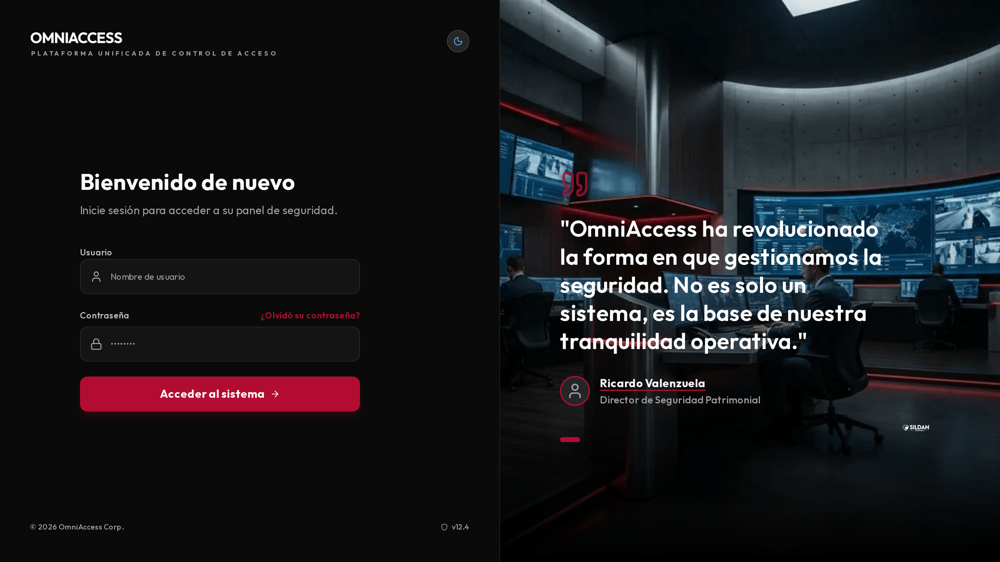
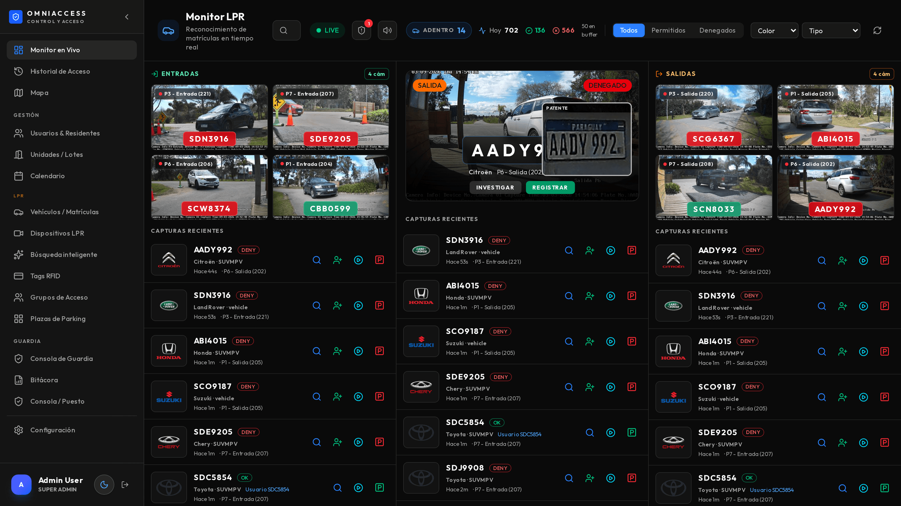
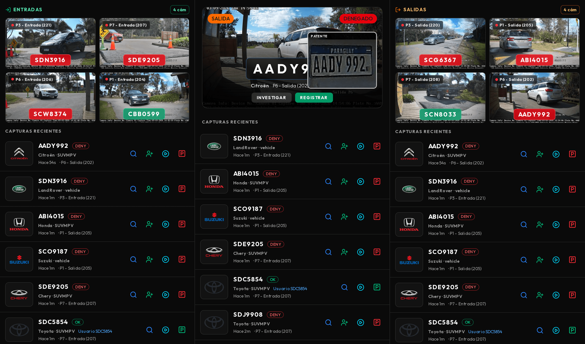
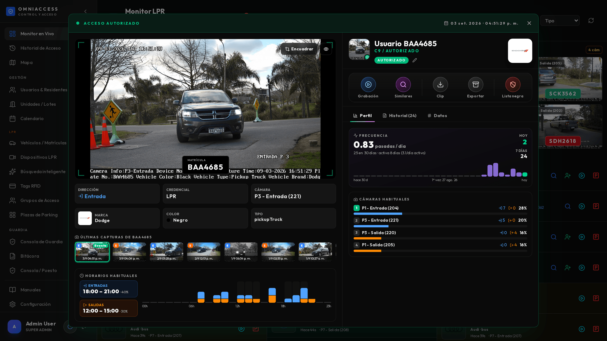
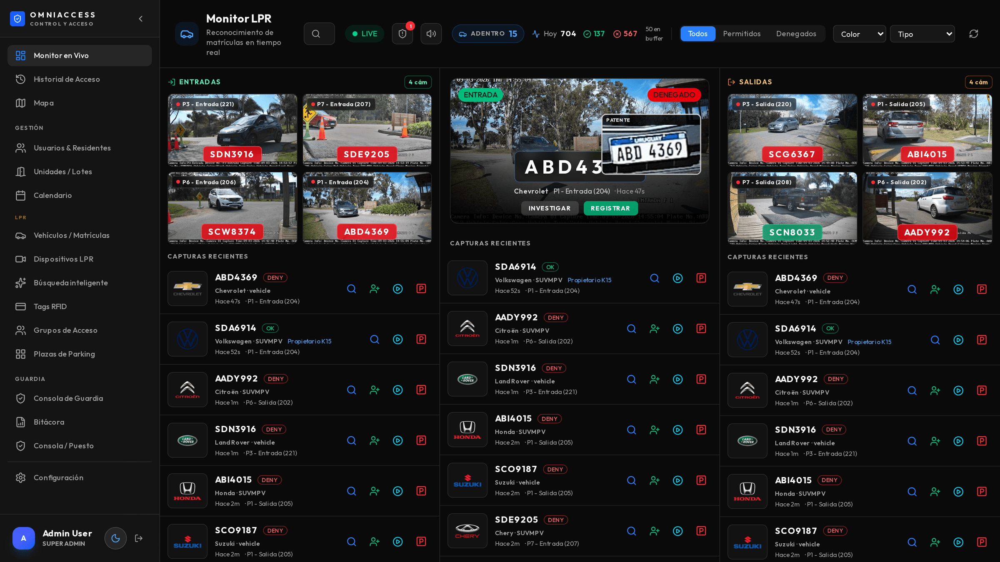
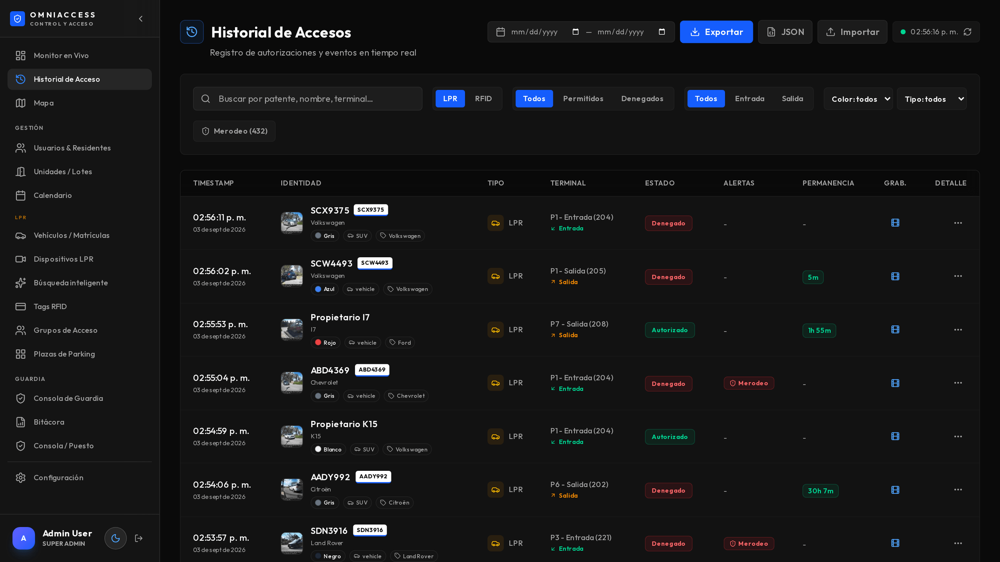
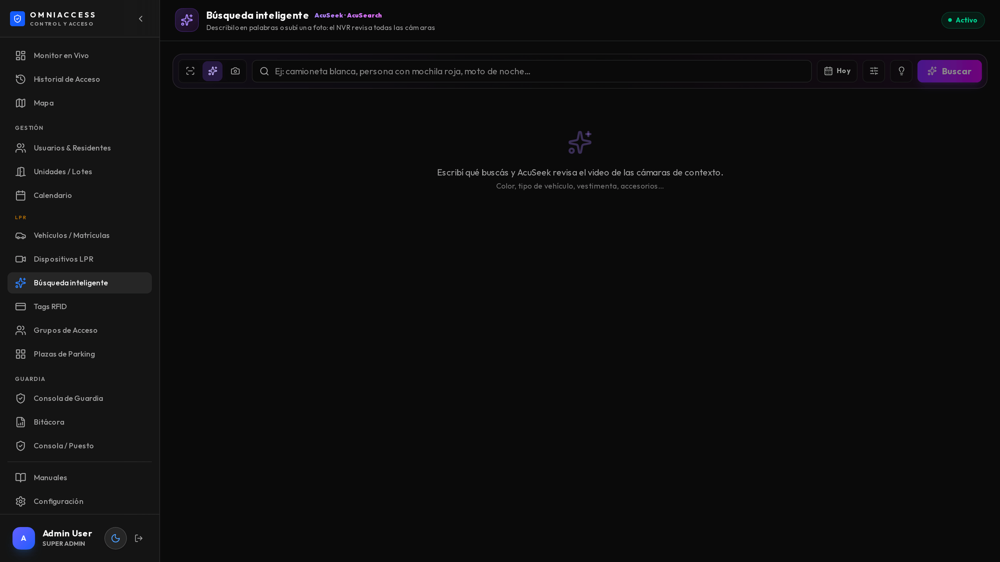
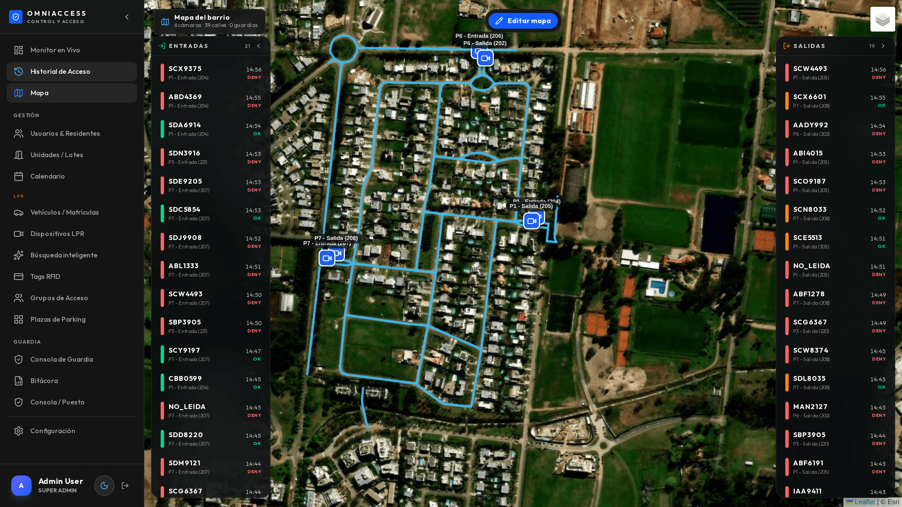
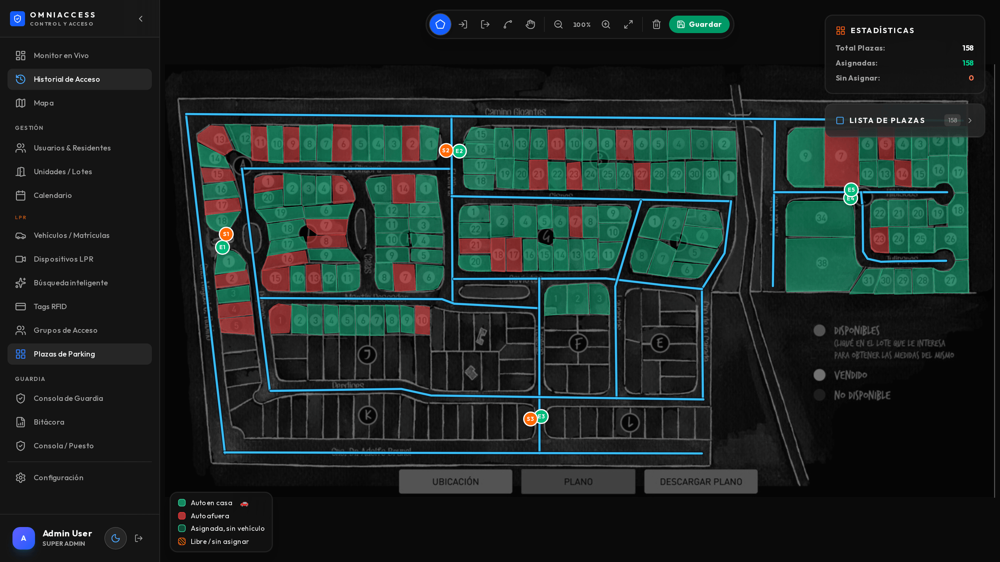

# Qué hace OmniAccess

OmniAccess controla los accesos vehiculares de un predio cerrado leyendo la matrícula de cada
vehículo que llega, decidiendo si está autorizado, y dejando registro fotográfico y en video de
todo lo que pasa. Funciona sin intervención humana; el operador interviene solo cuando el sistema
levanta la mano.

## Todo lo que hace, en detalle

### Lectura de matrículas y control de acceso

| Función | Qué hace exactamente |
|---|---|
| **Lectura ANPR** | Cada cámara lee la matrícula del vehículo que cruza su línea de detección, con la confianza de lectura (habitualmente 95–99 %) |
| **Decisión de acceso** | Contrasta contra la base de vehículos autorizados y su horario permitido; devuelve Autorizado, Denegado o Lista negra |
| **Clasificación del vehículo** | La cámara reporta marca, color y tipo (auto, camioneta, pickup, van, camión, ómnibus, buggy, moto) sin configuración adicional |
| **Entrada / salida** | Cada cámara está declarada como entrada o salida: el sistema sabe quién está adentro en cada momento |
| **Permanencia** | Al salir, calcula cuánto tiempo estuvo adentro ese vehículo |
| **Merodeo** | Detecta un vehículo que pasa repetidas veces por el mismo acceso sin ingresar |
| **Lista de vigilancia** | Matrículas marcadas (buscada, prohibida, VIP) que disparan alerta sonora y visual al aparecer |
| **Registro fotográfico** | Foto completa de la escena y recorte de la patente, guardados por cada evento |

### Investigación y búsqueda

| Función | Qué hace exactamente |
|---|---|
| **Historial completo** | Todos los accesos, filtrables por fecha, cámara, dirección, resultado y matrícula |
| **Perfil de matrícula** | Frecuencia de pasadas por día, cámaras habituales con desglose entrada/salida, y franjas horarias típicas |
| **Búsqueda en lenguaje natural** | Se escribe como se habla: "camioneta blanca ayer a la tarde", "entradas denegadas de noche" |
| **Búsqueda por imagen** | Se encuadra un vehículo o una persona en una foto y el sistema lo busca en las demás cámaras |
| **Grabación sincronizada** | Desde cualquier evento se abre el video del NVR en ese segundo exacto |
| **Exportación de evidencia** | Un ZIP con foto, recorte de patente, clip de video y datos del evento, listo para entregar |

### Operación diaria

| Función | Qué hace exactamente |
|---|---|
| **Monitor en vivo** | Pantalla de tres columnas pensada para mirarse de lejos, con video de todas las cámaras |
| **Mapa del predio** | Cámaras, accesos, calles, guardias con GPS y vehículos en circulación |
| **Plazas de parking** | Ocupación en tiempo real sobre la foto real del estacionamiento |
| **Bitácora** | Novedades del turno con foto, ubicación y firma del guardia |
| **Alta desde el monitor** | Registrar un vehículo nuevo sin salir de la pantalla donde apareció |

### Guardias en movimiento (tablet Android)

| Función | Qué hace exactamente |
|---|---|
| **Rondas con NFC o QR** | Puntos de control físicos que se marcan acercando la tablet, con hora y guardia |
| **Alerta de punto perdido** | Si un punto con horario asignado no se marca, avisa al puesto |
| **Botón de pánico** | Manteniendo 3 segundos; también con la pantalla bloqueada, por volumen |
| **Hombre caído** | Detecta inmovilidad prolongada y avisa si el guardia no cancela |
| **Posición en vivo** | El supervisor ve dónde está cada guardia, con batería y orientación |
| **Trabajo sin señal** | Rondas y bitácora siguen funcionando y se sincronizan al recuperar cobertura |

### Avisos y reportes

| Función | Qué hace exactamente |
|---|---|
| **Notificaciones** | Telegram, WhatsApp, correo y notificación push, con foto o clip de video |
| **Reglas configurables** | Qué evento avisa, a quién y por qué canal |
| **Salud de equipos 24/7** | Vigila cámaras y NVR: caída, disco, memoria, reloj desfasado, motor de lectura apagado |
| **Reportes** | Excel y PDF con la marca del cliente |

## En qué nos diferenciamos

> Esta sección existe porque la mayoría de los sistemas de control de acceso vehicular hacen lo
> primero de la lista y nada de lo demás. Lo que sigue es lo que se nota al mes de uso.

**Funciona sin internet.** Todo el sistema —lectura, decisión, grabación, búsqueda, tablets—
corre dentro del predio. Si se corta el enlace, se sigue trabajando igual; solo se demoran los
avisos externos. La mayoría de las soluciones en la nube dejan el portón sin criterio cuando cae
el enlace.

**Investigación real, no solo un listado.** Un evento no es una fila en una tabla: es una ficha
con el perfil de comportamiento de esa matrícula, la grabación sincronizada, la búsqueda del mismo
vehículo en otras cámaras y la evidencia exportable en un clic.

**Búsqueda en lenguaje natural sobre los accesos.** Se escribe "camioneta blanca ayer a la tarde"
y responde al instante, sobre la base propia y sin depender del grabador. Es la diferencia entre
encontrar algo en segundos o revisar video durante una hora.

**El guardia es parte del sistema.** Rondas, pánico, hombre caído y bitácora en la misma
plataforma que los accesos, no en una aplicación separada de otro proveedor.

**Se anticipa a las fallas.** El sistema vigila sus propias cámaras y avisa cuando una deja de
leer matrículas —incluso cuando sigue mostrando imagen y parece sana. Es la falla que en otros
sistemas se descubre recién cuando alguien necesita una evidencia que nunca se grabó.

**Evidencia lista para entregar.** Un ZIP con foto, patente, video y datos, armado en el momento.
Sin pedirle nada al proveedor ni exportar desde tres sistemas distintos.

**Multi-marca.** Convive con cámaras Hikvision, Avicam y Akuvox, y con grabadores existentes: no
obliga a cambiar todo el parque instalado.

---

# Antes de empezar

Este manual es para quien está frente al sistema todos los días: el guardia de la garita, el
operador del puesto de monitoreo, el supervisor que revisa lo que pasó anoche.

No explica cómo se instala ni cómo se configura — eso está en los manuales del Instalador y del
Administrador. Acá está **qué ves, qué significa y qué hacés** en cada situación.

## El recorrido de un acceso

Cada vez que un vehículo llega a un acceso, la cámara lee la matrícula y el sistema decide, en
menos de dos segundos, si ese vehículo está autorizado. La decisión queda registrada con la foto,
la hora, la cámara y la dirección (entrada o salida). Nada se pierde: aunque nadie esté mirando la
pantalla, todo queda grabado y buscable.

> ⏱ Desde que el vehículo cruza la línea de detección hasta que aparece en el monitor pasan entre
> **1 y 3 segundos**. Si tarda más de 10 segundos de forma habitual, avisá al administrador: algo
> está degradado (red, cámara o servidor).

## Los tres estados de un acceso

| Estado | Color | Qué significa | Qué hacés |
|---|---|---|---|
| **Autorizado** | Verde | La matrícula está registrada y habilitada en este horario | Nada. Se abre solo (si hay barrera automatizada) |
| **Denegado** | Ámbar | La matrícula no está registrada, o está fuera de su horario | Verificás con el residente antes de abrir |
| **Lista negra** | Rojo + sonido | La matrícula está marcada como buscada o prohibida | Seguís el protocolo del cliente. **No abras sin autorización** |

> Un "Denegado" no es una alarma: la enorme mayoría son visitas, proveedores y vehículos nuevos que
> todavía nadie registró. La alarma real es el rojo.

## Cómo ingresar

» Navegador → dirección del sistema → usuario y contraseña

El sistema funciona en cualquier navegador moderno. No hace falta instalar nada en la PC del puesto.

Si te olvidaste la contraseña, el administrador te la restablece: no hay recuperación por correo
en instalaciones sin internet.

> ⚠ Una sesión abierta en el puesto de monitoreo queda abierta. Si el puesto es compartido entre
> turnos, cerrá sesión al irte — todo lo que se haga queda registrado a tu nombre en la auditoría.

---

# El Monitor en Vivo

» Menú lateral → Monitor en Vivo

Es la pantalla donde vas a pasar el turno. Está pensada para mirarse de lejos: los datos
importantes son grandes y los colores dicen todo sin que tengas que leer.

@ 10,4 Menú lateral: el resto de las pantallas
@ 47,6 Barra de estado: LIVE, vehículos adentro, totales del día y alertas
@ 22,20 Mosaico de cámaras de entrada
@ 58,26 Foco: la última detección, en grande
@ 88,20 Mosaico de cámaras de salida
@ 22,70 Capturas recientes de entrada
@ 88,70 Capturas recientes de salida

## Cómo está organizada

La pantalla tiene tres columnas:

- **Izquierda — Entradas.** Arriba, un mosaico con la última captura de cada cámara de entrada.
  Abajo, la lista de capturas recientes.
- **Centro — El foco.** La última detección, en grande, con la foto de la patente recortada.
  Es lo que mirás de reojo mientras hacés otra cosa.
- **Derecha — Salidas.** Igual que la izquierda, pero para las cámaras de salida.

## La barra superior

| Indicador | Qué te dice |
|---|---|
| **LIVE** (punto verde) | El monitor está recibiendo eventos en tiempo real. Si se pone gris, perdiste conexión con el servidor |
| **ADENTRO** | Cuántos vehículos entraron y todavía no salieron |
| **Hoy** | Total de lecturas del día, y el desglose de autorizados y denegados |
| **En buffer** | Eventos recibidos que todavía se están dibujando. Si crece mucho, la PC del puesto está exigida |
| **Campana** | Alertas sin leer (lista negra, merodeo, cámara caída) |
| **Parlante** | Activa o silencia el sonido de las alertas |

Los botones **Todos / Permitidos / Denegados** filtran la vista. Los desplegables **Color** y
**Tipo** filtran por características del vehículo — sirven cuando estás buscando "la camioneta
blanca que acaba de pasar".

## El foco central

Muestra la última detección con:

- La **matrícula** en grande y el recorte real de la patente (para que puedas verificar a ojo que
  el sistema leyó bien).
- **Marca, tipo y color** del vehículo, detectados por la cámara.
- **Cámara y hora**, y hace cuánto fue.
- Dos botones: **Investigar** (abre el detalle completo) y **Registrar** (da de alta al vehículo).

> Si la lectura salió mal (una letra cambiada), no la corrijas en el momento: registrá el vehículo
> con la matrícula correcta y avisá al administrador. Una matrícula que se lee mal de forma
> repetida es un problema de calibración de la cámara, no de ese auto.

## El sonido

Cuando entra un vehículo en lista negra suena una alerta y la tarjeta queda resaltada en rojo con
un anillo. El sonido se repite hasta que abrís el evento. Si el puesto es silencioso por la noche,
usá el botón del parlante — pero acordate de volver a activarlo.

---

# El detalle de un evento

Hacé clic en cualquier captura y se abre la ficha completa de ese acceso. Es la herramienta que más
vas a usar cuando algo hay que investigar.

@ 30,10 Estado del acceso y fecha/hora exacta
@ 22,32 Foto de la captura con la matrícula leída
@ 12,72 Datos del vehículo detectados por la cámara
@ 62,14 Quién es, si está registrado
@ 62,29 Las seis acciones
@ 62,41 Pestañas: Perfil, Historial y Datos
@ 62,60 Frecuencia de pasadas por día

## Lo que ves de un vistazo

- **Arriba**: el estado del acceso (autorizado / denegado / lista negra) y la fecha y hora exacta.
- **Izquierda**: la foto completa de la captura, con la matrícula sobreimpresa, y debajo los datos
  del vehículo (dirección, credencial, cámara, marca, color, tipo).
- **Derecha**: quién es (si está registrado), la barra de acciones, y tres pestañas con el análisis.

## Las seis acciones

| Acción | Para qué sirve |
|---|---|
| **Grabación** | Abre el video del NVR en ese instante exacto, con línea de tiempo |
| **Similares** | Busca ese mismo vehículo en las otras cámaras del barrio |
| **Clip** | Descarga un video MP4 de 30 segundos alrededor del evento |
| **Exportar** | Descarga un ZIP con la foto, el recorte de patente, el clip y los datos — es lo que se entrega ante un reclamo |
| **Registrar** | Da de alta un usuario con esa matrícula, sin salir de la pantalla |
| **Lista negra** | Marca esa matrícula: la próxima vez que aparezca, suena la alerta |

> ⏱ El clip y el ZIP se arman en el momento pidiéndole el video al NVR: tardan entre **5 y 15
> segundos**. Si el navegador parece trabado, esperá — se está descargando.

## Las tres pestañas

**Perfil** — el comportamiento habitual de esa matrícula:

- **Frecuencia**: cuántas veces pasa por día, cuántas hoy, cuántas en la última semana, y un
  gráfico de los últimos 30 días.
- **Cámaras habituales**: por qué accesos entra y sale normalmente, con el porcentaje.
- **Horarios habituales**: en qué franja entra y en qué franja sale, con el histograma del día.

Esto sirve para responder rápido la pregunta que importa: *¿este vehículo es habitual acá o es la
primera vez?* Un auto que entra todos los días a las 8 y hoy entra a las 3 de la mañana es un dato,
aunque esté autorizado.

**Historial** — todos los accesos anteriores de esa matrícula, con fecha, cámara, dirección y
resultado.

**Datos** — la información técnica del evento: dispositivo, ubicación, identificador, canal del NVR
y los metadatos que envió la cámara.

## Buscar el mismo vehículo en otras cámaras

Con **Encuadrar** dibujás un recuadro sobre el vehículo (o sobre una persona) y el sistema lo busca
en las cámaras de contexto del barrio. Sirve para reconstruir un recorrido: entró por el portón 1 y
querés saber por dónde siguió.

1. Clic en **Encuadrar**.
2. Arrastrá el mouse para dibujar un recuadro sobre el objetivo.
3. Clic en **Buscar recorte** (o en el ícono de persona, si es una persona).
4. Aparecen las coincidencias ordenadas por parecido, con el porcentaje y la cámara.

> ⏱ La búsqueda tarda entre **10 y 40 segundos** según el rango de días. Mientras trabaja ves una
> animación con el avance; podés cambiar el rango (24 h / 3 días / 7 días) y el nivel de parecido.

> Esta búsqueda mira las **cámaras de contexto**, no las de matrículas. Las cámaras de los portones
> están dedicadas a leer patentes y no alimentan este buscador. Es una limitación del hardware, no
> una falla.

---

# Buscar en el historial

» Menú lateral → Historial de Acceso

Todos los accesos, con filtros por fecha, cámara, dirección, resultado y matrícula. Cada fila abre
la misma ficha del evento.

La columna **Grabación** indica si ese acceso tiene video disponible en el NVR. Si dice "sin NVR",
esa cámara no está mapeada a un canal de grabación.

## Búsqueda inteligente

» Menú lateral → Búsqueda inteligente

Es la forma rápida de encontrar algo cuando no tenés la matrícula. Se escribe en lenguaje normal.

Tiene tres modos, que se eligen con los íconos de la izquierda:

| Modo | Qué busca | Cuándo lo usás |
|---|---|---|
| **Accesos** (verde) | Los accesos de los portones, por descripción | "Camioneta blanca que entró ayer a la tarde" |
| **Por texto** (violeta) | Las cámaras de contexto, por descripción | "Persona con mochila roja" |
| **Por imagen** (fucsia) | Las cámaras de contexto, a partir de una foto | Tenés una foto y querés saber dónde más estuvo |

En el modo **Accesos** podés combinar: color, tipo de vehículo (auto, camioneta, pickup, van,
camión, ómnibus, buggy, moto), marca, matrícula, acceso (P1 a P7), entradas o salidas, autorizados
o denegados, franja del día (mañana, tarde, noche, madrugada) y fechas ("hoy", "ayer", "esta
semana", "últimos 3 días").

Ejemplos que funcionan tal cual:

- `camioneta blanca ayer a la tarde`
- `autos negros por P7`
- `entradas denegadas hoy`
- `buggy el fin de semana`
- `SCT4403`

Debajo del buscador aparecen unas etiquetas verdes con lo que el sistema entendió. Si escribís algo
que no reconoce, te lo dice — así sabés por qué el resultado no es el que esperabas.

> ⏱ La búsqueda por Accesos es **instantánea** (menos de 1 segundo): busca en la base de datos
> propia. Las otras dos consultan al NVR y tardan entre 10 y 40 segundos.

---

# El mapa del barrio

» Menú lateral → Mapa

Muestra el plano del barrio con las cámaras, los accesos, las calles y — si hay guardias con tablet
— su posición en tiempo real.

- Clic en una cámara: ves su video en vivo.
- Los vehículos que entran aparecen como íconos que se mueven por las calles hacia su destino.
- El panel lateral muestra el flujo de entradas y salidas en vivo.

# Plazas de parking

» Menú lateral → Plazas de Parking

Sobre la foto real del estacionamiento, cada plaza se pinta de **verde** (libre) o **rojo**
(ocupada), según las lecturas de matrícula. Al pasar el mouse por una plaza ocupada ves qué
vehículo está.

---

# La tablet del guardia

Los guardias que recorren usan una tablet Android con la aplicación de OmniAccess: rondas con
etiquetas NFC, botón de pánico, detección de hombre caído, bitácora con foto y posición en el mapa.

Desde el puesto de monitoreo, lo que aportan las tablets se ve en tres lugares:

- **Mapa** — la posición de cada guardia en turno, con su batería.
- **Bitácora** — las novedades que cargan, con foto y ubicación.
- **Alertas** — pánico, hombre caído y puntos de ronda vencidos.

> El funcionamiento completo de la tablet está en un manual aparte: **Manual de la Tablet**,
> pensado para el guardia que la usa. Acá alcanza con saber qué llega al puesto y qué hacer con eso.

## Qué hacer cuando llega una alerta de un guardia

| Alerta | Qué significa | Qué hacés |
|---|---|---|
| **Pánico** | El guardia mantuvo el botón 3 segundos | Llamalo por radio. Si no responde, mirá su posición en el mapa y enviá apoyo |
| **Hombre caído** | La tablet quedó inmóvil y el guardia no canceló en 30 s | Igual que pánico. Puede ser falsa alarma: confirmalo por radio |
| **Punto de ronda vencido** | Un punto con horario no se marcó a tiempo | Consultá por radio. Anotá el motivo en la bitácora |

> ⏱ Una alerta de pánico llega al puesto en **2 a 4 segundos** desde que el guardia suelta el botón.
> Si un guardia avisa que activó el pánico y en el puesto no sonó nada, es un problema técnico:
> reportalo de inmediato.

# Situaciones frecuentes

## Llega un vehículo que no está registrado

1. En el foco central o en la tarjeta, clic en **Registrar**.
2. Se abre el alta con la matrícula ya cargada.
3. Completá nombre y unidad/lote. Guardá.
4. La próxima vez que entre, ya figura como autorizado.

Si no tenés autorización para dar de alta, dejá la novedad en la bitácora con la matrícula y que la
resuelva el administrador.

## Un residente reclama que no le abrió

1. Buscá la matrícula en **Búsqueda inteligente** (escribí la matrícula tal cual).
2. Abrí el evento de esa hora.
3. Mirá el resultado: si dice **Denegado**, la matrícula no estaba registrada o estaba fuera de
   horario. Si no aparece ningún evento, la cámara no lo leyó — mirá la grabación para confirmar
   que el vehículo pasó.
4. Con **Exportar** generás el ZIP con la evidencia para adjuntar al reclamo.

## Hay que entregar evidencia de un incidente

Usá **Exportar** en la ficha del evento. El ZIP contiene:

- `captura.jpg` — la foto completa del momento
- `recorte_matricula.jpg` — el acercamiento de la patente
- `clip_30s.mp4` — el video del NVR alrededor del evento
- `evento.json` — todos los datos (hora, cámara, vehículo, decisión)

Es material suficiente para una denuncia o un reclamo al seguro.

## Una cámara dejó de mostrar imagen

1. Fijate si el resto de las cámaras andan. Si son todas, es el servidor o la red.
2. Si es una sola, avisá al administrador con el **nombre exacto** de la cámara (por ejemplo
   "P7 – Entrada (207)").
3. El sistema detecta las cámaras caídas solo y genera una alerta, pero tu aviso acelera la
   respuesta.

## Dejaron de entrar matrículas de golpe

Si el contador de "Hoy" no sube y hace rato que no aparecen capturas nuevas, avisá **de inmediato**
al administrador. No es normal y tiene diagnóstico conocido. Mientras tanto, el control de accesos
hay que hacerlo a mano.

---

# Buenas prácticas del turno

- **Al empezar**: mirá el contador de "Adentro" y la campana de alertas. Si quedaron alertas sin
  leer del turno anterior, revisalas.
- **Durante**: no dejes el navegador minimizado. El monitor está pensado para estar siempre visible.
- **Ante una duda**: es preferible verificar con el residente que abrir por las dudas. Todo queda
  registrado, incluso lo que no hiciste.
- **Al terminar**: dejá la novedad del turno en la bitácora, aunque sea "sin novedad". Es lo que
  después permite reconstruir qué pasó.
