# Para qué sirve la consola del guardia

La consola del guardia **reemplaza el cuaderno de la garita**. Esa es su razón de ser: dejar
constancia de todo lo que entra y sale del predio —autos, motos, personas— con la matrícula, el
nombre y el lote al que va, sin escribir a mano y sin que la letra o la hoja arrancada se pierdan.

Todo lo demás que hace la aplicación —las cámaras de matrícula, las plazas, el mapa, el pánico,
las rondas— viene **encima** de eso. Si el guardia sólo aprende a registrar bien, la aplicación
ya está cumpliendo su función.

## El cuaderno y la consola, lado a lado

| | Cuaderno | Consola del guardia |
|---|---|---|
| Escribir la matrícula | A mano, con la letra de cada uno | Casillero por casillero, siempre legible |
| Saber si el auto ya vino | Hay que pasar hojas | Aparece solo al escribir la matrícula |
| El lote de destino | De memoria o preguntando | Se elige de la lista de unidades del predio |
| Foto del vehículo | No hay | Foto de la patente y de la escena |
| Buscar un registro de la semana pasada | Imposible en el momento | Búsqueda por matrícula o por fecha |
| Ver qué anotó el turno anterior | Si dejó el cuaderno | Está en el historial, siempre |
| Que el administrador lo vea | Hay que ir a buscar el cuaderno | Lo ve en el panel, en el momento |
| Si se moja, se pierde o lo arrancan | Se perdió | Está en el servidor |

## Qué queda registrado de cada movimiento

Cada vez que se confirma un registro, el sistema guarda:

| Dato | De dónde sale |
|---|---|
| **Matrícula** | La escribe el guardia, o la completa la cámara si el vehículo ya cruzó |
| **Tipo de vehículo** | Auto o moto — cambia el formato de matrícula que espera |
| **Nombre del visitante** | Lo escribe el guardia |
| **Documento** | Lo escribe el guardia |
| **Lote / unidad de destino** | Se elige del padrón del predio |
| **Observaciones** | El motivo de la visita, en palabras del guardia |
| **Foto** | Opcional: patente, vehículo o persona |
| **Nota de voz** | Opcional, cuando escribir lleva más tiempo que hablar |
| **Ingreso o egreso** | Lo elige el guardia |
| **Hora exacta** | La pone el sistema, no se puede cambiar |
| **Quién lo registró** | El guardia con la sesión abierta |
| **Permanencia** | Se calcula sola al registrar la salida |

> Lo que no se registra, no existe. Un vehículo que entró sin registro es un vehículo que después
> nadie puede explicar.

## Lo que se agrega arriba del registro

| Función | Para qué le sirve al guardia |
|---|---|
| **Accesos por matrícula (LPR)** | Ver qué leyeron las cámaras de los portones, con foto y video |
| **Plazas de parking** | Saber qué lugares están libres y cuáles ocupados |
| **Mapa** | Ver dónde están los compañeros y las cámaras |
| **Botón de pánico** | Pedir auxilio con la posición GPS |
| **Rondas con NFC** | Marcar los puntos de control sin abrir nada |
| **Hombre caído** | La tablet pide ayuda sola si el guardia queda inmóvil |
| **Sin señal** | Todo se guarda en la tablet y se sube cuando vuelve la red |

## En qué nos diferenciamos

| | OmniAccess | Lo habitual en el mercado |
|---|---|---|
| Registro de visita | Se completa solo con la lectura de la cámara | Se tipea todo a mano, o sigue el cuaderno |
| Lote de destino | Del padrón real del predio, con buscador | Texto libre, cada uno lo escribe distinto |
| Matrícula no identificada | Se registra desde la misma pantalla | Hay que llamar al administrador |
| Evidencia | Foto, video del NVR y datos desde la fila del acceso | Video en un sistema aparte |
| Pánico | En pantalla y con el equipo bloqueado, con GPS | Botón físico o nada |
| Rondas | NFC sin abrir la aplicación; se suben sin señal | Planilla de papel |
| Seguridad del guardia | Hombre caído automático | No existe |
| Sin internet | Sigue registrando y sube después | Se corta la operación |

## Dos formas de usarla

| | Navegador (tablet o PC) | Aplicación Android (APK) |
|---|---|---|
| Registro de visitantes | Sí | Sí |
| Historial y LPR | Sí | Sí |
| Plazas y mapa | Sí | Sí |
| Botón de pánico en pantalla | Sí | Sí |
| **Pánico con la pantalla bloqueada** | No | Sí (botón de volumen) |
| **Rondas con etiquetas NFC** | No | Sí |
| **Hombre caído** | No | Sí |
| **Posición GPS en segundo plano** | Limitada | Sí |
| **Modo kiosco** (no se puede salir) | No | Sí |

> La aplicación Android es la que se entrega a los guardias que recorren. En la garita, donde la
> tablet está fija y enchufada, el navegador alcanza.

## Qué necesita la tablet

| Requisito | Mínimo | Recomendado |
|---|---|---|
| Sistema | Android 9 | Android 12 o superior |
| Pantalla | 8″ | 10″ |
| Memoria | 3 GB | 4 GB |
| NFC | Solo para rondas | Sí |
| GPS | Sí | Sí |
| Red | WiFi del predio | WiFi + datos de respaldo |

> ⚠ La tablet que sale a recorrer tiene que quedar **dedicada**. Si se usa también para música o
> mensajería, Android termina cerrando la aplicación en segundo plano y se pierden posición y
> rondas.

# Registrar un movimiento

» Barra inferior → Acceso

Esta es **la pantalla principal**. Es donde se pasa la mayor parte del turno y la que reemplaza al
cuaderno. Todo lo demás del manual es accesorio comparado con esto.

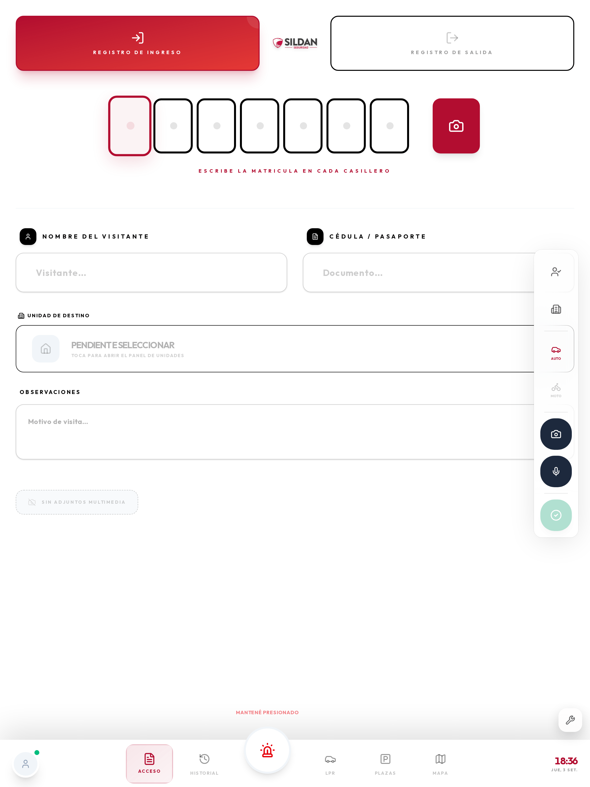

## Los tres pasos, siempre en este orden

1. **Ingreso o egreso.** Se elige arriba, antes que nada. Es lo que define si el registro suma o
   resta del conteo de gente adentro.
2. **La matrícula.** Un carácter por casillero. Si el vehículo ya cruzó por una cámara de los
   portones, el sistema lo reconoce y completa nombre y unidad solos.
3. **El lote de destino.** Se toca el panel y se elige de la lista real de unidades del predio.

Con esos tres datos el registro ya sirve. El resto lo enriquece.

## Los campos, uno por uno

| Campo | Qué se escribe | Cuándo es obligatorio |
|---|---|---|
| **Ingreso / Salida** | El sentido del movimiento | Siempre |
| **Matrícula** | La patente, un carácter por casillero | Siempre que haya vehículo |
| **Auto / Moto** | El tipo de vehículo | Siempre — cambia el formato de matrícula esperado |
| **Nombre** | Nombre y apellido de quien conduce | Visitas y proveedores |
| **Documento** | Cédula o el documento que presente | Visitas y proveedores |
| **Unidad de destino** | A qué lote va | Siempre |
| **Observaciones** | El motivo, en palabras claras | Cuando aporta algo |
| **Foto** | Patente, vehículo o persona | Cuando hay algo que mostrar |
| **Nota de voz** | Lo mismo, hablado | Cuando escribir demora |

> ⏱ Con la matrícula reconocida por la cámara, el registro completo lleva **menos de 20 segundos**.
> Escribiendo todo a mano, alrededor de un minuto. El registro se guarda en **menos de 2 segundos**
> y aparece de inmediato en el puesto de monitoreo.

## Motos

Tocá **Moto** antes de escribir la matrícula. Las motos en Uruguay tienen un formato distinto al de
los autos, y si queda marcado *Auto* el sistema espera una patente que no existe y la marca como
inválida.

## El lote de destino

Es el dato que más se usa después: es lo que permite responder *"¿quién vino a la casa 42 esta
semana?"*. Tocá el panel de destino para abrir la lista completa de unidades del predio y buscá por
número o por apellido.

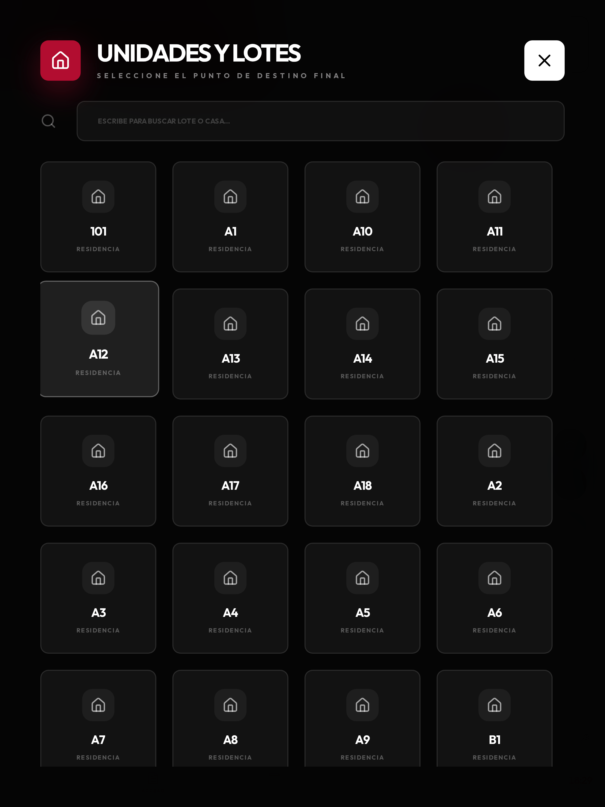

> ⚠ No escribas el lote en observaciones. En el campo de destino queda enlazado a la unidad real
> y sirve para buscar; en observaciones es sólo texto.

## Qué escribir en observaciones

Sirve para lo que no entra en ningún campo. Frases cortas y concretas:

- `Reparto — nombre de la empresa`
- `Service de aire acondicionado, autorizado por el residente`
- `Vino a buscar a un menor, lo autorizó la madre por portero`
- `No traía documento, se verificó con la unidad`

Lo que **no** conviene: *"visita"*, *"ok"*, *"pasó"*. No agregan nada que el registro no diga ya.

## Los botones de la columna derecha

| Botón | Qué hace |
|---|---|
| Persona | Marca el tipo de visitante |
| Edificio | Abre la lista de unidades de destino |
| **Auto / Moto** | Tipo de vehículo (cambia el formato de matrícula esperado) |
| Cámara | Saca una foto y la adjunta |
| Micrófono | Graba una nota de voz |
| **Confirmar** (verde) | Guarda el registro |

## Reglas de anotación

- **Un movimiento, un registro.** Si entran dos vehículos, son dos registros.
- **Registrá en el momento**, no al final del turno. La hora la pone el sistema y no se corrige.
- **Si dudás, anotá.** Un registro de más no molesta; uno de menos no se puede recuperar.
- **Nunca dejes el destino vacío.** Es el campo que después permite buscar.
- **No compartas la sesión.** Lo registrado queda a nombre de quien la tenga abierta.

# Registrar la salida

» Barra inferior → Acceso → Registro de Salida

Al elegir **Registro de Salida** y escribir la matrícula, el sistema busca el ingreso previo,
completa los datos y calcula **cuánto tiempo estuvo adentro**.

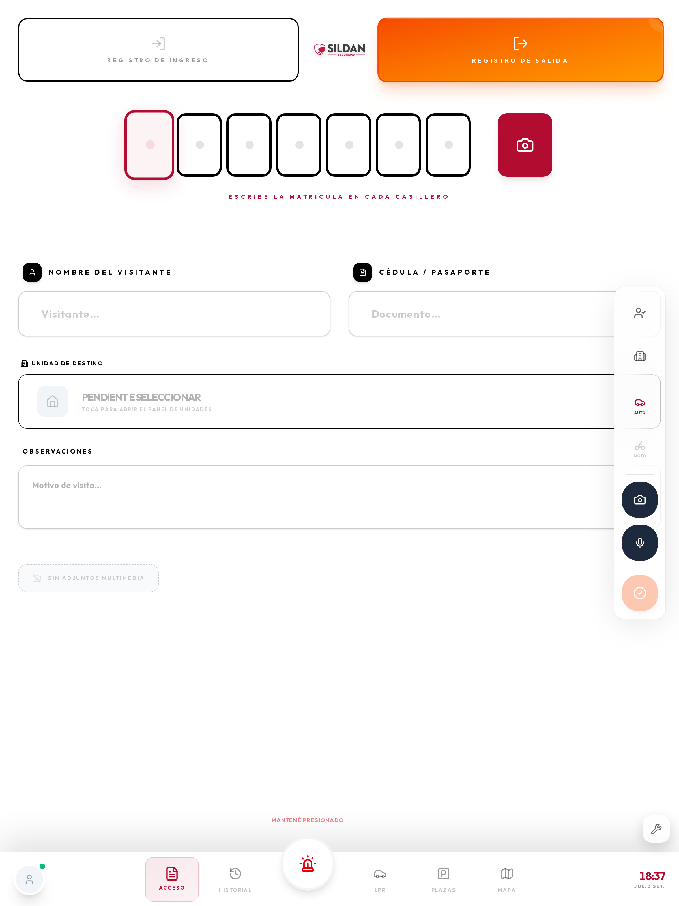

Si el visitante entró a pie, o el ingreso no quedó registrado, cargalo igual con lo que sepas y
aclaralo en observaciones. Es preferible un registro incompleto a ninguno.

# Historial del turno

» Barra inferior → Historial

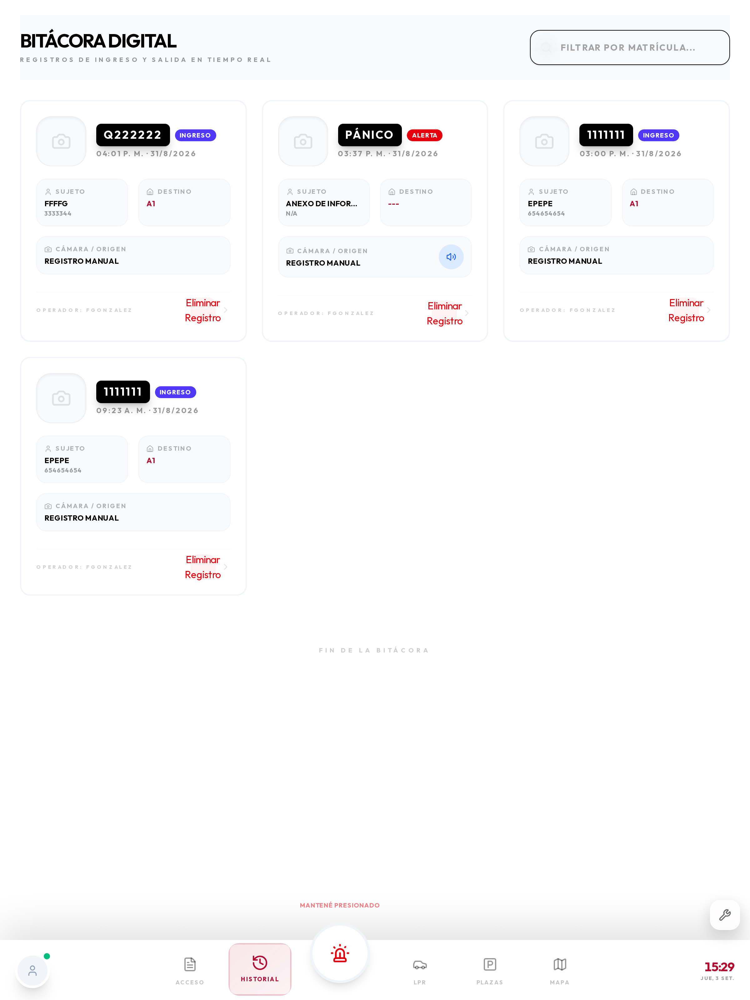

Muestra todo lo registrado, con hora, matrícula, visitante y destino. Sirve para dos cosas:

- **Verificar** algo que se registró hace un rato.
- **Cerrar una visita**: se busca el ingreso y se registra la salida desde ahí.

Arriba tiene búsqueda por texto y filtro por fecha.

# Ingresar y moverse por la aplicación

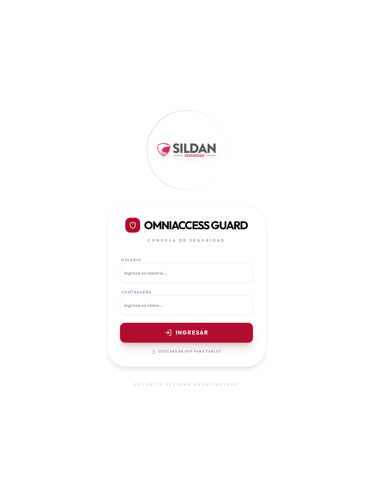

1. Abrí la aplicación (o el navegador en la dirección del sistema, con `/guard` al final).
2. Ingresá **usuario** y **contraseña** de guardia.
3. Tocá **Ingresar**.

La sesión queda abierta durante el turno. Desde la pantalla de ingreso también se puede
**descargar la aplicación para tablet** con el enlace de abajo.

> ⏱ El ingreso demora **1 a 3 segundos** con WiFi. Si la contraseña es correcta pero no entra,
> el problema es de red: fijate el indicador de conexión.

## La barra inferior

Es la navegación principal y está siempre visible:

| Botón | Para qué |
|---|---|
| **Acceso** | Registrar el ingreso o egreso de un movimiento |
| **Historial** | Ver los registros del turno |
| **Pánico** (centro, rojo) | Pedir auxilio manteniendo presionado |
| **LPR** | Ver las matrículas que leyeron las cámaras |
| **Plazas** | Ocupación del estacionamiento |
| **Mapa** | Ubicación de guardias y cámaras |

A la izquierda del todo está tu **perfil**, con el punto de conexión, y a la derecha la hora y la
fecha.

# Accesos por matrícula (LPR)

» Barra inferior → LPR

Es la lista de lo que están leyendo las cámaras de los portones, en vivo. Para el registro sirve
para dos cosas: **confirmar una matrícula** que no se llegó a ver, y **registrar un vehículo** que
entra siempre y figura como no identificado.

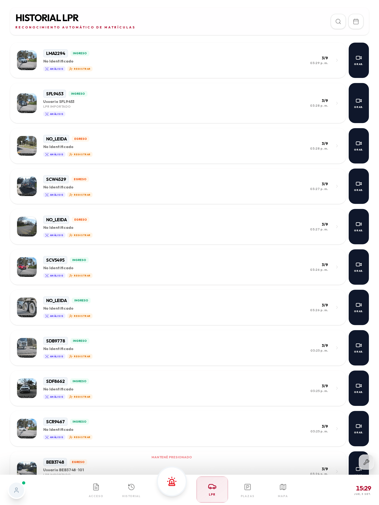

## Qué muestra cada fila

- **Foto** del vehículo en el momento de la lectura.
- **Matrícula** leída (o `NO_LEIDA` si la cámara no pudo).
- **Ingreso** o **Egreso**, según la cámara.
- **Quién es**: el nombre del propietario si está registrado, o "No identificado".
- **Hora** de la lectura.

## Las tres acciones de cada fila

| Acción | Qué hace |
|---|---|
| **Análisis** | Abre la ficha completa: perfil de la matrícula, historial y datos |
| **Registrar** | Da de alta ese vehículo, con la matrícula ya cargada |
| **Grab.** | Abre la grabación del NVR en ese segundo exacto |

> Cuando una matrícula figura como "No identificado" y el vehículo entra habitualmente, conviene
> registrarlo: cada vez que pasa genera un acceso denegado que ensucia las estadísticas.

# Plazas de parking

» Barra inferior → Plazas

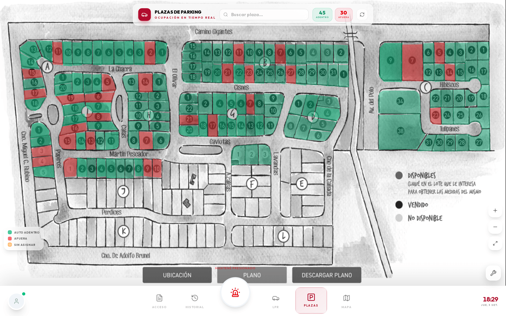

Sobre la foto del plano del estacionamiento, cada plaza se pinta según su estado:

- **Verde**: libre.
- **Rojo**: ocupada.

La ocupación se calcula con las lecturas de matrícula. Tocando una plaza ocupada se ve qué vehículo
está y desde cuándo.

# Mapa

» Barra inferior → Mapa

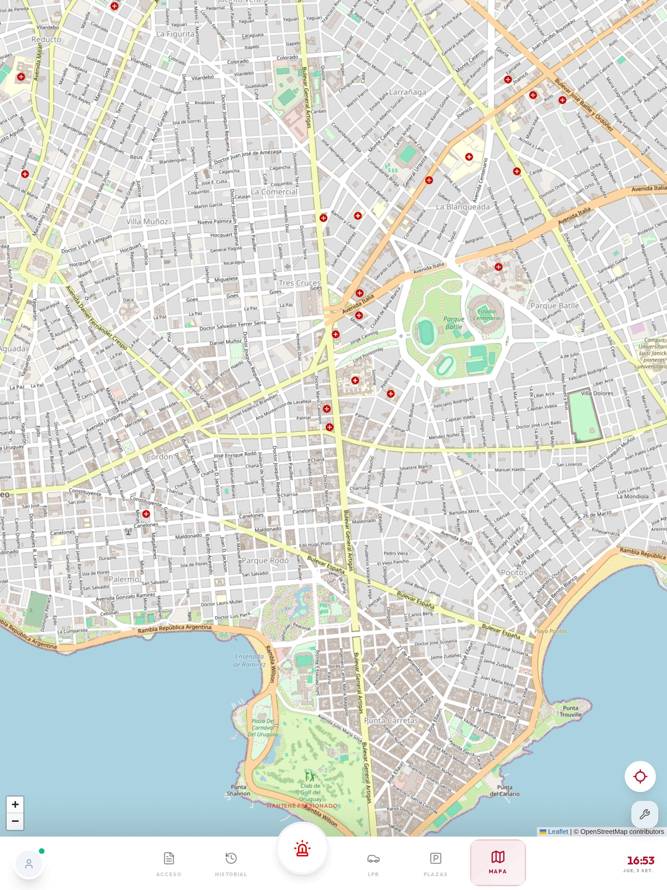

Muestra el plano del predio con:

- **Tu posición**, actualizada mientras te movés.
- **Los otros guardias** en turno, con nombre y batería.
- **Las cámaras** y los accesos.
- **Los vehículos** que están circulando.

> La posición se envía cada **10 segundos** con la aplicación en pantalla, y cada **30 segundos**
> con la pantalla apagada (solo en la aplicación Android). Es un compromiso entre precisión y
> duración de la batería.

# El botón de pánico

Es la función más importante después del registro. Está diseñada para que **no se dispare por
accidente** y para que **funcione cuando hace falta**.

## Dónde está

Es el botón rojo del **centro de la barra inferior**, más grande que los demás y separado. Encima
tiene la leyenda *Mantené presionado*, que es exactamente lo que hay que hacer.

## Cómo se activa, paso a paso

1. **Apoyá el dedo** sobre el botón rojo y **no lo sueltes**.
2. Alrededor del botón aparece un **anillo** que se va completando.
3. Cuando el anillo da la vuelta entera —**1,5 segundos**— la alerta se dispara y la tablet vibra.
4. Recién ahí podés soltar.

> Si soltás antes de que el anillo se complete, **no pasa nada**: la alerta no se envía y el anillo
> vuelve a cero. Es a propósito, para que un roce en el bolsillo no dispare una falsa alarma.

## Con la pantalla bloqueada

Solo con la aplicación Android: presioná el botón de **volumen** varias veces seguidas, sin
desbloquear ni sacar la tablet del bolsillo. Se habilita durante la instalación, con el permiso de
accesibilidad.

> ⚠ No hay activación por sacudida ni por gesto: se descartó porque genera falsas alarmas, y una
> alarma en la que nadie confía no sirve.

## Qué pasa cuando se activa

En menos de 3 segundos:

1. La tablet vibra y confirma en pantalla, que queda en modo alerta.
2. Suena la alerta en el puesto de monitoreo.
3. Se envía tu posición GPS.
4. Se avisa al supervisor por los canales configurados.
5. Queda registrado en la bitácora con hora y ubicación.

Mientras la alerta está activa, la pantalla queda en rojo y aparecen las herramientas para
**anexar** una foto, un audio o una nota a esa alerta: lo que grabes queda pegado al evento.

> ⏱ Del momento en que se completa el anillo a que suene en el puesto pasan **2 a 4 segundos** con
> WiFi. Sin señal, la tablet reintenta y avisa en pantalla que la alerta está pendiente.

## Desactivar la alerta

Se mantiene presionado el mismo botón, ahora durante **2 segundos**. Es más largo que la activación
a propósito: cancelar una alerta tiene que costar más que dispararla.

## Falsa alarma

Avisá por radio al puesto y desactivala. La alerta queda registrada igual — y está bien que quede:
lo que se anota es que fue falsa, no se borra.

# Funciones de la aplicación Android

Estas funciones **no existen en el navegador**: requieren la aplicación instalada.

## Rondas con etiquetas NFC

Cada punto de control tiene una etiqueta pegada en el predio.

1. Caminá hasta el punto.
2. Acercá el **dorso de la tablet** a la etiqueta, a menos de 2 cm.
3. La tablet vibra y confirma el punto.

No hay que abrir nada: funciona aunque estés en otra pantalla.

> ⏱ La marca se registra en **menos de 2 segundos** con WiFi. Sin señal queda guardada y se sube
> sola: no esperes parado al lado del punto.

Si un punto tiene horario asignado y vence sin marcarse, se genera una alerta en el puesto. No es
un reproche automático: puede haber una razón. Por eso conviene dejarla anotada.

## Hombre caído

La tablet vigila su propio movimiento. Si queda inmóvil y horizontal más del tiempo configurado
(habitualmente 60 segundos):

1. Muestra un aviso con cuenta regresiva y suena.
2. Si nadie responde en **30 segundos**, dispara la alerta igual que el pánico.

Para cancelar, tocá **Estoy bien**.

> Si tenés que dejar la tablet quieta un rato, apoyala **de canto o en el bolsillo**. La posición
> horizontal es parte de lo que dispara la detección.

## Modo kiosco

La aplicación queda fija: no se puede salir a otras aplicaciones ni a los ajustes. Para salir
(solo el técnico): mantener presionado el logo 5 segundos e ingresar la clave de administración.

# Instalación y permisos

» Pantalla de ingreso → Descargar app para tablet

La aplicación no está en Google Play: se descarga desde el propio sistema.

1. Abrí el navegador de la tablet en la dirección del sistema, con `/guard`.
2. Tocá **Descargar app para tablet**.
3. Habilitá en Android: **Ajustes → Seguridad → Instalar aplicaciones desconocidas**.
4. Abrí el archivo descargado y confirmá.
5. Concedé los permisos (ver abajo).
6. Iniciá sesión.

## El permiso de ubicación

Es el único que tiene trampa. Android ofrece tres opciones y **solo una sirve**:

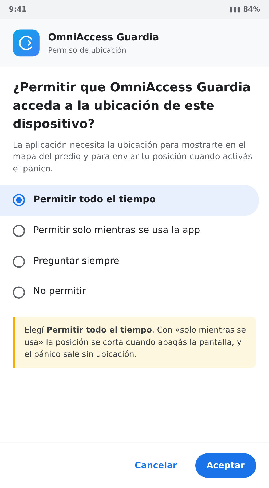

Elegí **Permitir todo el tiempo**. Con *"solo mientras se usa la app"* la posición se corta apenas
se apaga la pantalla: el guardia desaparece del mapa y el pánico sale sin ubicación.

> Android puede pedir este permiso en dos pasos: primero *"mientras se usa"* y después, la primera
> vez que la tablet queda con la pantalla apagada, un segundo aviso para pasar a *"todo el tiempo"*.
> Si aparece, aceptalo.

## Cómo debe quedar la lista de permisos

Se revisa en **Ajustes → Aplicaciones → OmniAccess Guardia → Permisos**:

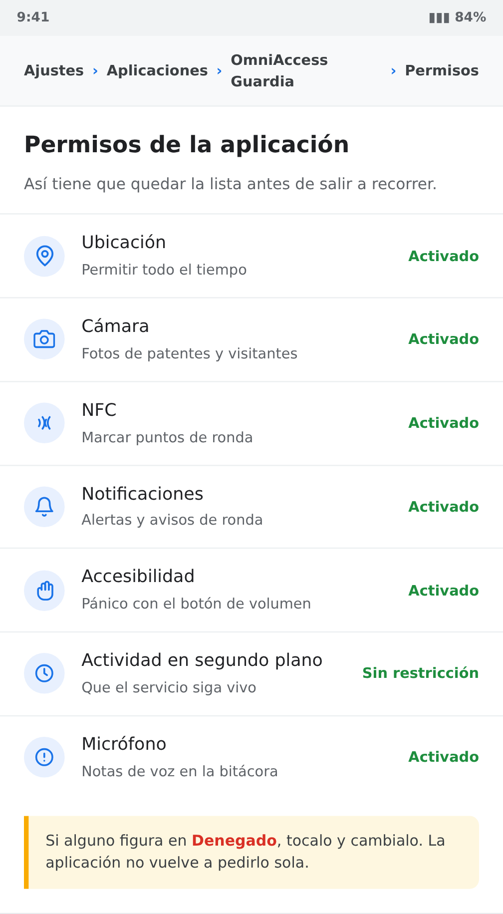

| Permiso | Para qué | Si falta |
|---|---|---|
| **Ubicación (siempre)** | Posición en el mapa y en el pánico | No aparecés en el mapa |
| **Cámara** | Fotos de patentes y visitantes | No se pueden adjuntar fotos |
| **Micrófono** | Notas de voz en la bitácora | No se pueden grabar audios |
| **NFC** | Rondas | No se pueden marcar puntos |
| **Notificaciones** | Alertas y avisos de ronda | No te enterás de nada con la app cerrada |
| **Segundo plano** | Que el servicio siga vivo | Se pierde posición con la pantalla apagada |
| **Accesibilidad** (opcional) | Pánico por volumen bloqueado | Solo funciona el pánico en pantalla |

> ⚠ Si alguno figura en **Denegado**, tocalo y cambialo a mano. Android no lo vuelve a pedir solo
> después de la primera negativa.

## La optimización de batería

Es la causa número uno de *"la tablet dejó de reportar posición"*. Android duerme la aplicación con
la pantalla apagada y se pierden posición y rondas.

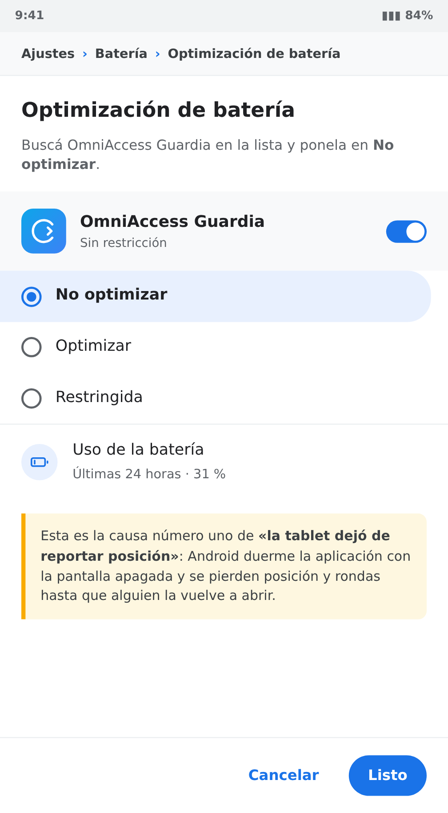

Ruta: **Ajustes → Batería → Optimización de batería**, buscar *OmniAccess Guardia* y ponerla en
**No optimizar**. En algunas marcas el menú se llama distinto:

| Marca | Dónde está |
|---|---|
| Samsung | Ajustes → Batería → Límites de uso en segundo plano → Apps que nunca se suspenden |
| Xiaomi | Ajustes → Apps → OmniAccess → Ahorro de batería → Sin restricciones |
| Motorola / Android puro | Ajustes → Apps → OmniAccess → Batería → Sin restricciones |
| Huawei | Ajustes → Batería → Inicio de apps → OmniAccess → Gestión manual (las tres opciones activadas) |

# Situaciones típicas del turno

Este capítulo no explica pantallas: explica **qué hacer** en los casos que pasan todos los días.

## 1 · Llega una visita anunciada

El residente avisó que espera a alguien.

1. **Acceso** → *Registro de Ingreso*.
2. Escribí la **matrícula**. Si el auto ya cruzó la línea de la cámara, nombre y unidad aparecen
   solos.
3. Completá **nombre** y **documento**.
4. Elegí la **unidad de destino** y anotá el motivo.
5. Confirmá con el botón verde.

## 2 · Llega alguien que no está anunciado

El procedimiento es el mismo, con un paso más antes: **verificá con la unidad** por portero o
teléfono. Recién con la confirmación registrás el ingreso y abrís.

> ⚠ Si no hay confirmación, no abras. Anotá el intento en la bitácora con la matrícula: si vuelve,
> el sistema muestra que ya estuvo.

## 3 · Entra una moto

Tocá **Moto** antes de escribir la matrícula. Si el repartidor no baja del vehículo, alcanza con
matrícula, nombre y destino; el documento se pide cuando la visita entra caminando.

## 4 · Un reparto o un proveedor

Registralo como visita normal, con dos cuidados:

- En **observaciones**, poné la empresa (`Reparto — nombre de la empresa`). Es lo que después
  permite contar cuántos repartos entran por día.
- Si es un vehículo que viene siempre, conviene **registrarlo** para que deje de figurar como
  denegado. Se hace desde **LPR** → botón *Registrar* de esa fila.

## 5 · La cámara leyó una matrícula que no está registrada

Aparece en **LPR** con el cartel *No identificado* y el sello **DENY**.

1. Abrí la pestaña **LPR**.
2. Buscá la fila.
3. Tocá **Análisis** para ver la ficha completa y confirmar de qué vehículo se trata.
4. Si corresponde, tocá **Registrar**: la matrícula viene precargada.

## 6 · Alguien reclama por un golpe en el estacionamiento

Lo que se entrega como evidencia sale de acá:

1. **LPR** → buscá la matrícula y el horario aproximado.
2. Tocá **Grab.** en la fila: se abre la grabación del NVR en ese segundo.
3. Si hace falta el archivo, pedile al puesto de monitoreo que **exporte el evento** (foto +
   recorte de la patente + video de 30 segundos, en un ZIP).

## 7 · Registrar la salida de un visitante

1. **Acceso** → *Registro de Salida*.
2. Escribí la matrícula: el sistema encuentra el ingreso y completa los datos.
3. Confirmá.

## 8 · Una emergencia

Mantené presionado el **botón rojo** hasta que el anillo dé la vuelta entera. Si la tablet está
bloqueada en el bolsillo, usá el botón de **volumen** (aplicación Android).

Después de disparar la alerta: quedate donde estás si es seguro, la posición ya se envió. Si te
movés, se sigue actualizando.

## 9 · Se cortó el WiFi en medio del turno

El punto junto a tu perfil pasa a **ámbar**. Seguí trabajando igual:

- Los registros se guardan en la tablet.
- Las rondas NFC se marcan igual.
- Al volver la señal, todo se sube solo, con la hora real en que ocurrió.

> ⚠ Lo único que **no** funciona sin señal es ver el video en vivo y las grabaciones del NVR.
> El pánico se envía apenas vuelve la red, y la tablet avisa en pantalla que quedó pendiente.

# Mantenimiento y problemas

## Rutina

**Cada turno:** cargarla al terminar y entregarla con más del 50 %. Verificar que el punto de
conexión esté verde antes de salir.

**Cada semana:** reiniciar la tablet. Android acumula procesos y la aplicación se vuelve lenta.
Limpiar la pantalla y el dorso (donde está el NFC).

## El indicador de conexión

Es el punto de color junto a tu perfil, abajo a la izquierda.

| Color | Significa | Qué podés hacer |
|---|---|---|
| **Verde** | Conectado | Todo |
| **Ámbar** | Sin conexión, con datos por subir | Registrar y marcar rondas (se guardan) |
| **Rojo** | Sin conexión hace rato | Lo mismo; avisá al puesto por radio |

## Problemas frecuentes

| Síntoma | Qué hacer |
|---|---|
| La matrícula queda marcada como inválida | Fijate si está en **Moto** o en **Auto**: el formato esperado es distinto |
| No encuentro el lote en la lista | Buscá por número y por apellido; si no está, avisá al administrador |
| No lee las etiquetas NFC | Verificá que el NFC esté activado; acercá el **dorso**, no el frente |
| No aparezco en el mapa | Ubicación en "siempre" y salí al exterior 30 segundos |
| La aplicación se cierra sola | Optimización de batería: ponela en "No optimizar" |
| Punto rojo con WiFi conectado | El servidor no responde: avisá al puesto |
| La lista de LPR no se actualiza | Deslizá hacia abajo para refrescar; si sigue, revisá la conexión |
| No responde a nada | Mantené el botón de encendido 10 segundos para forzar el reinicio |

> Si la tablet se pierde o la roban, avisá **de inmediato**: desde el panel se le revoca el acceso
> y deja de recibir y enviar datos.

# Preguntas frecuentes

**¿Si se me apaga la tablet pierdo lo que registré?**
No. Todo se guarda en la tablet apenas se confirma, y se sube cuando hay señal.

**¿Puedo corregir un registro que cargué mal?**
El registro no se borra. Cargá el dato correcto y aclaralo en observaciones: el historial muestra
las dos entradas y se entiende qué pasó.

**¿Y si el visitante no quiere dar el documento?**
Registrá lo que tengas y anotalo en observaciones. Después es la unidad la que decide si autoriza.

**¿Puedo usar mi celular?**
Para el navegador sí, con limitaciones de pantalla. Para las funciones de ronda, pánico bloqueado
y hombre caído hace falta la aplicación en una tablet dedicada.

**¿El supervisor ve todo lo que hago?**
Ve tu posición mientras estás en turno, lo que registrás y las rondas que marcás. No tiene acceso
remoto al micrófono ni a la cámara.

**¿Qué pasa si dos guardias usan la misma tablet?**
Cada uno abre sesión con su usuario. Lo registrado queda a nombre de quien tenía la sesión abierta.

**¿Cuánto dura la batería?**
Una jornada de 8 horas usa entre 25 % y 40 % con la configuración de fábrica. Si consume mucho
más, revisá que no haya otras aplicaciones corriendo.
